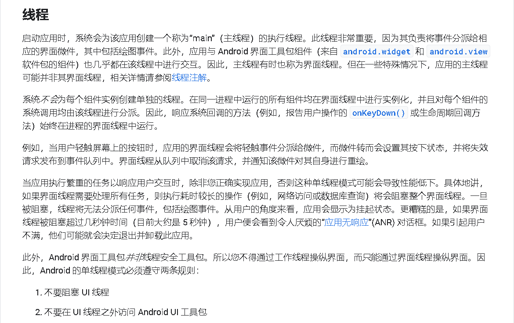

# `IPC`

---

- `Android`多进程概念以及多进程开发模式中常见的注意事项

- `Android`序列化机制和`Binder`

- 进程间通信方式

  `Bundle`、`文件共享`、`AIDL`、`Messenger`、`ContentProvider`、`Socket`等多进程通信的方式

- `Binder`连接池

- 进程间通信方式的有缺点和适用场景

---

## 1. `Android IPC`简介

> `IPC`是`Inter-Process Communication`的缩写，含义为`进程间通信`或者`跨进程通信`，指代两个进程之间进行数据交换的过程。

### 进程与线程

**`Linux`进程与线程**

> https://segmentfault.com/a/1190000019781604

**进程的创建和执行**

`Linux`进程的创建和执行主要依托于`fork`和`exec`。`fork and exec`的流程就表示了`Linux`系统中的进程呼叫：进程由父进程以`fork`的方式产生一个一模一样的子进程，子进程通过`exec`方式去执行实际要执行的程序，最终会成为一个子进程。


> 流程：
>
> - 以`fork`方式复制一个与父进程相同的暂存进程，唯一区别是与父进程的`PID`不同。子进程还会多出一个`PPID`的参数，即父进程的进程标识符。
> - 暂存进程以`exec`方式加载实际要执行的程序。

```c
int main() {
    pid_t pid;
    if ((pid = fork() < 0) {
        printf("fork error\n");
    } else if (pid == 0) {
    // child
       if (execle("/home/work/bin/test1", "test1", NULL) < 0) {
            printf("exec error\n");
       }
    }
    // parent
    if (waitpid(pid, NULL) < 0) {
        printf("wait error\n");
    }
}
```

> `fork`从当前进程创建一个子进程，函数返回两次：对于父进程来说返回的是子进程的进程号，对于子进程来说返回`0`。子进程是父进程的副本，拥有与父进程一样的数据空间、堆栈副本，并且共享了代码段。
>
> 子进程通常是为了调用`exec`装载其他程序执行，所以`Linux`采用了`写时拷贝`技术，也就是数据段、堆栈的副本不会再`fork`之后就真正拷贝，只是将这些内存区域的访问权限变为只读，如果父子进程中有任一个要修改这些区域，才会修改对应的内存页生成新的副本，这样做的目的是为了提高系统性能。

`fork`之后父进程和子进程的执行顺序是不确定的，如果需要父子进程之间同步，需要使用进程间通信，`fork`之后子进程会继承父进程的如`打开的文件`、`实际用户ID、组用户ID`、`进程组`、`当前工作目录`等等内容。

父子进程的区别在于：

- 进程`ID`不同
- 子进程不继承父进程的文件锁
- 子进程的未处理信号集为空
- ...

`Linux`中的`ls`显示文件、`touch`创建文件、`rm/mkdir/cp/mv`等指令管理文件、`chomd/chown/passwd`等指令管理权限等指令触发的`PID`很快就会终止。而在内存中常驻的进程称为`daemon`(服务)，一般负责系统所提供的功能以服务用户各项任务。

系统服务大致分为系统本身需要的服务：`crond`或`atd`等以及网络联机的服务`Appache`、`named`等。网络服务被执行后会启动一个负责网络监听的端口(`port`)，以提供和外部客户端的联机要求。

> `Linux`希望可以简单判断该程序是否是`daemon`，所以一般`daemon`类型的程序会加上后缀`d`。

**进程描述符**

> `Linux`操作系统采用了`task_struct`的数据结构保存进程运行时的所有信息，称为进程描述符。
>
> 进程描述符完整描述了一个进程：`打开的文件`、`进程的地址空间`、`挂起的信号`以及进程的信号等。系统将所有进程描述符放在一个双端循环列表中：
>
> 
>
> 而进程描述符放置在内核的末尾。
>
> 进程中占用的内存一部分是栈，用于函数调用，不过这里的栈一般指的是用户空间的栈。进程中还有内核栈，当进程调用系统调用时，进程陷入内核，此时内核代表进程执行某个操作，此时使用的是内核空间的栈。

**进程状态**

进程描述符中的`state`描述了进程当前的状态：

- `TASK_RUNNING`：进程可执行。进程正在执行或者在运行队列等待调度
- `TASK_INTERRUPTIBLE`：进程正在睡眠（阻塞），等待条件达成。如果条件达成或者受到信息，进程会被唤醒并且进入可运行状态
- `TASK_UNINTERRUPTIBLE`：进程处于不可中断状态，就算信号也无法唤醒，这种状态用的比较少
- `_TASK_TRACED`：进程正在被其它进程追踪，通常是为了调试
- `_TASK_STOPPED`：进程停止运行，通常是接收到`SIGINT`、`SIGTSTP `信号的时候。

**`fork`和`vfork`**

在使用了写时拷贝后，`fork` 的实际开销就是复制父进程的页表以及给子进程创建唯一的进程描述符。

`fork` 为了创建一个进程到底做了什么呢？`fork` 其实调用了 `clone`，这是一个系统调用，通过给 `clone` 传递参数，表明父子进程需要共享的资源，`clone` 内部会调用 `do_fork`，而 `do_fork` 的主要逻辑在 `copy_process` 中，大致有以下几步：

1. 为新进程创建一个内核栈以及 `task_struct`，此时它们的值与父进程相同
2. 将 `task_struct `中某些变量，如统计信息，设置为 0
3. 将子进程状态设置为 `TASK_UNINTERRUPTIBLE`，保证它不会被投入运行
4. 分配 `pid`
5. 根据传递给 `clone` 的参数，拷贝或者共享打开的文件、文件系统信息、信号处理函数以及进程的地址空间等。
6. 返回指向子进程的指针

除了`fork`之外，`Linux`还有一个类似的函数`vfork`，功能与`fork`类似，子进程在父进程的地址空间运行。不过，父进程会阻塞，直到子进程退出或者执行`exec`，需要注意的是，子进程不能向地址空间写入数据。如果子进程修改数据、进行函数调用或者没有调用`exec`会带来未知的结果。`vfork`在`fork`没有写时拷贝的技术时是有着明显的性能优势的，现在来看或许没有太大的优势。

**进程的退出**

`5`+`3`：有5种方式正常终止，有3种方式异常终止

正常终止：

- 从`main`返回
- 调用`exit`
- 调用`_exit`或`_Exit`
- 最后一个线程从其启动例程返回
- 从最后一个线程调用 `pthread_exit`

异常终止：

- 调用`abort`
- 接收一个信号
- 最后一个线程对取消请求做出响应


`exit`会执行标准`I/O`库的清理操作：对所有打开的流调用`fclose`函数，所有缓冲中的数据会被冲洗，而`_exit`会直接陷入内核。

```c
#include <stdio.h>
#include <stdlib.h>
#include <unistd.h>

int main()
{
    printf("line 1\n");
    printf("line 2"); // 没有换行符

    // exit(0)
    _exit(0);
}
```

进程退出出最终会执行到系统的`do_exit`函数，主要有以下步骤：

- 删除进程定时器
- 释放进程占用的页表
- 递减文件描述符的引用计数，如果某个引用计数为`0`，则关闭文件
- 向父进程发信号，让子进程重新寻找父进程（养父），并把进程状态设置为`EXIT_ZOMBIE`
- 调度其他进程。

此时，进程的大部分资源都被释放并且不会进入运行状态，不过还有些资源保持着，主要是`task_struct`结构，目的是为了让父进程知道子进程的一些信息。如果父进程不执行任何操作，那么这些信息会一直保留在内存中成为僵尸进程。

```c
int main() {
    pid_t pid = fork();
    if (pid == 0) {
        exit(0);
    } else {
        sleep(10);
    }
}
```

如果父进程先结束了呢？在父进程结束的时候，会为其子进程找新的父进程，一直往上找，最终成为 `init` 进程的子进程。`init` 子进程会负责调用 `wait` 释放子进程的遗留信息。

**线程**

在`Linux`中没有真正的内核线程，是以进程的方式实现的，只不过会共享内存。

`Linux`一开始是不支持线程的，后来出现了线程库`LinuxThreads`。但是与`POXIS`标准不兼容，存在很多问题。自`Linux 2.6`以来，`Linux`中使用的就是新的线程库`NPTL (Nativce POSIX Thread Library)`

`NPTL`中线程的创也是通过`clone`实现。并且通过以下的参数表明了参数的特征

> ```objectivec
> CLONE_VM | CLONE_FILES | CLONE_FS | CLONE_SIGHAND | CLONE_THREAD | CLONE_SETTLS | 
> CLONE_PARENT_SETTID | CLONE_CHILD_CLEARTID | CLONE_SYSVSEM
> ```

部分参数含义：

-  `CLONE_VM`：所有线程共享同一地址空间
- `CLONE_FILES`：所有线程共享进程的文件描述符列表
- `CLONE_THREAD`：所有线程都共享同一个进程`ID`及父进程`ID`

**`Android`进程与线程**

**线程**

线程是`CPU`调度的最小单元，有限的系统资源；

***`Android Developer`***



**进程**

进程一般指代一个执行单元，在`PC`和移动应用指代一个程序或者一个应用。一个进程可以包含多个线程，所以可以理解为进程和线程是包含和被包含的关系。

***`Android Developer`***


**区别**

主要区别在于对于**操作系统资源管理方式**不同。

- **进程：**有独立地址空间，在进程崩溃后，保护模式下一般不会对其他进程产生影响。

- **线程：**有自己的堆栈和局部变量，但是线程之间没有单独的地址空间，一个线程死掉就等于整个进程死掉。


**优缺点**

- 线程执行开销小，但是不利于资源管理和保护，适合在多处理器的机器上运行。
- 进程恰好相反，进程切换资源消耗较大，效率较差；健壮性比多线程程序较强；可以跨机器迁移。


> 在`Android`中，当应用组件启动且该应用未运行任何其他组件时，`Android`系统会使用单个执行线程为应用启动新的`Linux`进程。默认情况下，同一应用的所有组件会在相同的进程和线程（成为主线程），如果某个应用组件启动时该应用已经存在进程(啊因为存在该应用的其他组件)，则该组件会在此进程内启动并使用相同的执行线程。
>
> `Android`中的四大组件可以通过在`AndroidManifest`清单文件中设置`android:process`的方式指定四大组件运行的进程。

> https://developer.aliyun.com/article/25392


### `IPC`简介

 任何操作系统都有`IPC`机制

 - `Windows`：剪切板、管道、邮槽
 - `Linux`：命名管道、共享内容、信号量

 `Android`是基于`Linux`内核的移动操作系统，它的进程间通信方式不能完全继承`Linux`，拥有自己的进程间通信方式。

 `Android`中最有特色的进程间通信方式是`Binder`。除了`Binder`还支持`Socket`，可以实现任意两个终端之间的通信。

**多进程**

多进程的使用场景:

- 某些模块需要运行在单独的进程中
- 加大应用的内存空间


## 2. `Android`中的多进程模式

### 开启多进程模式

> 正常情况下，`Android`中的多进程是指一个应用中存在多个进程的情况。

在`Android`中使用多进程的方式：

- 在`AndroidManifest`清单文件中为四大组件指定`android:process`属性。

  无法给一个线程或者实体类指定其运行时所在的进程。

- (非常规)通过`JNI`在`native`层`fork`一个新的进程。暂不考虑。

> 对于四大组件来说，默认没有指定`process`属性那么运行在默认进程中，进程名为包名。

可以使用`adb shell "ps | grep com.xxx.xxx"`指令查看进程信息

对于进程名：

`:remote`的含义是在当前的进程名前附加上当前的包名，是一种简写的方式。属于当前应用的私用进程，其他应用的组件不可以和它跑在统一进程中。

不加`:`的进程属于全局进程，其他应用通过`ShareUID`方式可以和它跑在同一个进程中。

> `Android`系统为每一个应用分配了一个唯一的`UID`，具有相同`UID`的应用才能共享数据。两个应用通过`ShareUID`跑在同一个进程中是有要求的，需要这两个应用有相同的`ShareUID`并且签名相同才可以，在这种情况下，他们可以互相访问对方的私有数据，比如`data目录`、组件信息等；如果跑在同一个进程汇总，除了能共享`data`目录，组件信息，还可以共享内存数据，或者说他们看起来就像一个应用的两个部分。	

`Android`为每一个应用分配了一个独立的虚拟机，或者说为每个进程分配了一个独立的虚拟机。在不同的进程中访问同一个类对象会产生多份副本。所以通过使用内存共享数据是失败的。这也是多进程带来的主要影响。正常情况下，四大组件不能通过某个中间层来共享数据。当然某些组件之间不需要共享数据，可以直接指定`android:process`属性来开启多进程。

一般来说，使用多进程会造成：

- 静态成员和单例模式失效

- 线程同步机制失效

- `SharedPreferences`可靠性下降

  `SharedPreference`不支持两个进程同时执行写操作，否则会导致一定几率的数据丢失。因为`SharedPreferences`底层是通过读写`xml`文件的方式实现，并发写会出问题，甚至并发读写都有可能出现问题。

- `Application`多次创建

  相当于系统又把这个应用启动了一遍，既然重新启动，自然会创建新的`Application`。可以理解为两个应用采用了`SharedUID`的模式


## 3. `IPC`基础概念

> `Serializable`、`Parcelable`接口完成对象的序列化过程。
>
> `Binder`

### `Serializable`

`Serializable`是`Java`提供的序列化接口，是一个空接口，为对象提供标准的序列化、反序列化操作。

使用`Serializable`实现序列化非常简单，只需要在类的声明中指定一个`serialVersionID`的标识即可自动实现默认的序列化过程。实际上，这个`serialVersionUID`也不是必需的。不声明这个`serialVersionUID`同样可以实现序列化，但是会对反序列化过程产生影响。

> `serialVersionUID`是用来辅助序列化和反序列化过程的，原则上序列化后的数据中的`serialVersionUID`只有和当前类的`serialVersionUID`相同才能正常被反序列化
>
> 工作机制：
>
> 序列化时把当前类的`serialVersionUID`写入序列化的文件中（或者其他中介）
>
> 反序列化时候系统会检测文件中`serialVersionUID`是否和当前类的`serialVersionUID`一致
>
> 如果一致，就说明序列化的类的版本和当前类的版本是相同的，这个时候可以成功反序列化；否则说明当前类和序列化的类相比发生了某些变换。因此会报错。
>
> 一般来讲，应该手动指定`serialVersionUID`的值，或者更具当前类的结构生成一个`hash`值。手动指定这个值很大程度上能够避免因为版本升级时增加或者删除成员变量造成的反序列化失败的问题。有一种非常规的情况，如果类结构发生非常规性改变，比如修改了类名，修改了成员变量的类型，这个时候尽管`serialVersionUID`验证通过了，但是反序列化过程还是会失败，因为类结构有了毁灭性的改变，无法从老版本的数据中恢复。
>
> 有两点需要注意：
>
> - 静态成员不会参与序列化过程
> - `transient`关键字标记的成员变量不参与序列化过程


```java
// 序列化过程
User user = new User("dong");
ObjectOutputStream objectOutputStream = null;
try {
    objectOutputStream = new ObjectOutputStream(
        new FileOutputStream("cache.txt")
    );
    objectOutputStream.writeObject(user);
} catch (IOException e) {
    e.printStackTrace();
} finally {
    if (objectOutputStream != null) {
        try {
            objectOutputStream.close();
        } catch (IOException e) {
            e.printStackTrace();
        }
    }
}

// 反序列化过程
ObjectInputStream objectInputStream = null;
try {
    objectInputStream = new ObjectInputStream(
        new FileInputStream("cache.txt")
    );
    User newUser = (User) objectInputStream.readObject();
} catch (IOException | ClassNotFoundException e) {
    e.printStackTrace();
} finally {
    if (objectInputStream != null) {
        try {
            objectInputStream.close();
        } catch (IOException e) {
            e.printStackTrace();
        }
    }
}
```

> 系统默认序列化过程也是可以改变的，通过实现`writeObject`或者`readObject`方法即可重写系统默认的序列化和反序列化的过程。

### `Parcelable`接口

`Android`提供了新的序列化方式——`Parcelable`接口。实现这个接口，类的对象就可以实现序列化并可以通过`Intent`和`Binder`传递。

典型的用法：

```java
public class User implements Parcelable {
    private String username;
    private Book book;

    public User(String username, Book book) {
        this.username = username;
        this.book = book;
    }

    private User(Parcel in) {
        username = in.readString();
        book = in.readParcelable(Thread.currentThread().getContextClassLoader());
    }

    @Override
    public int describeContents() {
        return 0;
    }

    @Override
    public void writeToParcel(Parcel dest, int flags) {
        dest.writeString(username);
    }

    public static final Creator<User> CREATOR = new Creator<User>() {
        @Override
        public User createFromParcel(Parcel in) {
            return new User(in);
        }

        @Override
        public User[] newArray(int size) {
            return new User[size];
        }
    };
}
```

**`Parcel`**

`Parcel`内部包装了可序列化的数据，可以在`Binder`种自由传输。在序列化过程中，需要实现：`序列化`、`反序列化`和`内容描述`。

序列化由`writeToParcel`方法完成，最终通过`Parcel`中一系列`write`方法来完成。

反序列化由`CREATOR`完成，内部标明了如何创建序列化`对象`和`数组`并通过`Parcel`一系列`read`方法完成反序列化过程。

内容描述由`describeContents`方法来完成，几乎在所有情况下返回`0`，仅当当前对象中存在文件描述符时此方法返回`1`。

**需要注意的是**

`Book`是另一个可序列化对象， 所以它的反序列过程需要传递当前线程的上下文类加载器，否则会报`ClassNotFound`异常。

> `Intent`、`Bundle`、`Bitmap`等均实现了`Parcelble`接口，`List`和`Map`也是可以序列化的（前提是每个元素都是可序列化的）。

**选择**

`Serializable`是`java`中的序列化接口，使用简单，但是序列化和反序列化过程伴随着大量的`IO`操作

`Parcelable`是`Android`中的序列化方式，因此更适合用在`Andorid`平台上，效率比较高，缺点是使用起来稍微麻烦一点。

在`Android`中，首选的序列化方式是`Parcelable`。但在将对象序列化到存储设备中或者将对象序列化后通过网络传输的情境下，`Parcelable`的使用比较复杂，建议使用`Serializable`方式。
