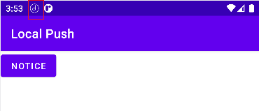

[Android Developer 通知概览](https://developer.android.google.cn/guide/topics/ui/notifiers/notifications)

[通知设计指南](https://material.io/design/platform-guidance/android-notifications.html#usage)

[清杀产品本地通知方案_RD](https://docs.google.com/document/d/1xR5Bz1_kUHTs463CQJ1ff6L-4oAcAsKW2TMRKIv_wD0/edit?usp=sharing)

> 通知是指 Android 在您应用的界面之外显示的消息，旨在向用户提供提醒、来自他人的通信信息或您应用中的其他实时信息。用户可以点按通知来打开应用，或直接从通知中执行操作。

## 外观

- 状态栏

  

- 抽屉式通知栏

  

- 提醒式通知

  `Android 5.0`开始，通知可以短暂显示在浮动窗口，叫做提醒式通知。适用于用户立即知晓的重要通知，并且设备未锁定

  

- 

