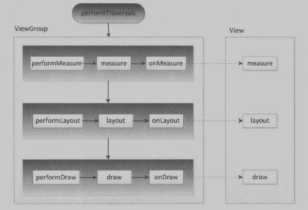

# `View`工作原理

---

> - `View`底层工作原理：`测量流程`、`布局流程`、`绘制流程`
>
> - `View`回调：`构造方法`、`onAttach`、`onVisibilityChanged`、`onDetach`等
>
> - `View`滑动冲突
>
> -  自定义`View`

## **1. `ViewRoot`和`DecorView`**

---

### `ViewRoot`

`ViewRoot`对应的是`ViewRootImpl`类，是连接`WindowManager`和`DecorView`的纽带。`View`三大流程就是通过`ViewRoot`完成的。

在`ActivityThread`中，当`Activity`对象被创建完毕后，会将`DecorView`添加到`Window`中，同时创建`ViewRootImpl`对象，并将`ViewRootImpl`对象和`DecorView`建立关联，参看源码：

***`WindowManagerGlobal#addView()`***

```java
synchronized (mLock) {
    ...
	root = new ViewRootImpl(View.getContext,display);
}
...
try{
	root.setView(view,wparams,panelParentView);    
}catch(RuntimeException e){
    ...
}
```

`View`绘制流程从`ViewRoot#performTraversals()`方法开始。经过`measure`、`layout`、`draw`三个过程最终将`View`绘制出来。

> `measure`：测量`View`的宽高；
>
> `layout`：确定`View`在父容器中放置的位置；
>
> `draw`：就爱那个`View`绘制在屏幕；

在`performTraversals()`方法中会依次调用`performMeasure()`、`performLayout()`、`performDraw()`



以`measure`为例：

`performTraversals`中先调用`measure`相关方法`performMesure()`。`performTraversals()`方法很长，摘取了部分源码：

***`ViewRootImpl#performTraversals()`***

```java
if (mFirst || windowShouldResize || insetsChanged ||
	    viewVisibilityChanged || params != null) {
    ...
    try {
        ...
        if (!mStopped) {
            ... 
			// Ask host how big it wants to be
        	performMeasure(childWidthMeasureSpec, childHeightMeasureSpec);
            ...
            if(measureAgain){
                performMeasure(childWidthMeasureSpec, childHeightMeasureSpec)
            }
        }
    }
}
```

在`performMeasure()`中调用父类`View`的`measure()`方法。

***`ViewRootImpl#performMeasure(int childWidthMeasureSpec, int childHeightMeasureSpec)`***

```java
private void performMeasure(int childWidthMeasureSpec, int childHeightMeasureSpec) {
    Trace.traceBegin(Trace.TRACE_TAG_VIEW, "measure");
    try {
        mView.measure(childWidthMeasureSpec, childHeightMeasureSpec);
    } finally {
        Trace.traceEnd(Trace.TRACE_TAG_VIEW);
    }
}
```

在`View#measure()`方法中回调`onMeasure()`方法

***`View#measure(int widthMeasureSpec, int heightMeasureSpec)`***

```java
public final void measure(int widthMeasureSpec, int heightMeasureSpec) {
    // ...
    if (forceLayout || !matchingSize &&
        (widthMeasureSpec != mOldWidthMeasureSpec ||
         heightMeasureSpec != mOldHeightMeasureSpec)) {
        // ...
        // measure ourselves, this should set the measured dimension flag back
        onMeasure(widthMeasureSpec, heightMeasureSpec);
        // ...
    }
}
```

在`onMeasure`方法中会对所有的子元素进行`measure`过程，这个时候`measure`流程就从父容器传递到子容器。 完成了`measure`过程。接着子元素会重复父容器的`measure`过程，由此反复完成整个`View`树的遍历。

**同理：**`performLayout`和`performDraw`的传递流程和`performMeasure`是类似的。只不过`performDraw`的传递过程是在`draw`方法中通过`dispatch`来实现。

***`ViewRootImpl#draw()`***

```java
// ...
mAttachInfo.mTreeObserver.dispatchOnDraw();
// ...
```

**`measure`**的过程决定了`View`的宽高；`measure`完成后，可以通过`getMeasuredWidth`和`getMeasuredHeight`方法获取到`View`测量后的宽高，在几乎所有情况下都等于`View`最终的宽高（特殊情况除外）。

**`Layout`**过程决定了`View`四个顶点的坐标和实际的`View`的宽高；`Layout`完成后，可以通过`getTop`、`getBottom`、`getLeft`和`getRight`获取到`View`四个顶点的位置，并且可以通过`getWidth`和`getHeight`方法来拿到`View`的最终宽高。

**`draw`**过程决定了`View`的显示；`draw`方法完成后`View`的内容才能呈现到屏幕上。


### `DecorView`

---

`DecorView`作为顶级的`View`，一般情况下会包含一个竖直方向的`LinearLayout`在这个`LinearLayout`里面有上下两个部分：标题栏+内容栏。在`Activity`中通过`setContentView`设置的布局文件就是加到了内容栏中，而内容栏的`id`是`content`。

从`Activity`的`setContentView`方法入手，`setContentView()`方法中调用`Window`设置`ContentView`

```java
public void setContentView(int layoutResID) {
    getWindow().setContentView(layoutResID);
    initWindowDecorActionBar();
}
```

`Window`的唯一实现子类`PhoneWindow`中声明了`DecorView`和`ContentView`相关的内容：

> The only existing implementation of this abstract class is `android.view.PhoneWindow`(`android.internal.policy.impl`), which you should instantiate when needing a Window.

```java
// This is the top-level view of the window, containing the window decor.
private DecorView mDecor;

// This is the view in which the window contents are placed. It is either
// mDecor itself, or a child of mDecor where the contents go.
private ViewGroup mContentParent;

private ViewGroup mContentRoot;
```

***`PhoneWindow#setContentView(int layoutResID)`***

***`PhoneWindow#setContentView(View view, ViewGroup.LayoutParams params)`***

```java
@Override
public void setContentView(int layoutResID) {
    // Note: FEATURE_CONTENT_TRANSITIONS may be set in the process of installing the window
    // decor, when theme attributes and the like are crystalized. Do not check the feature
    // before this happens.
    if (mContentParent == null) {
        installDecor();
    } else if (!hasFeature(FEATURE_CONTENT_TRANSITIONS)) {
        mContentParent.removeAllViews();
    }

    if (hasFeature(FEATURE_CONTENT_TRANSITIONS)) {
        final Scene newScene = Scene.getSceneForLayout(mContentParent, layoutResID, getContext());
        transitionTo(newScene);
    } else {
        mLayoutInflater.inflate(layoutResID, mContentParent);
    }
    final Callback cb = getCallback();
    if (cb != null && !isDestroyed()) {
        cb.onContentChanged();
    }
}

@Override
public void setContentView(View view, ViewGroup.LayoutParams params) {
    // Note: FEATURE_CONTENT_TRANSITIONS may be set in the process of installing the window
    // decor, when theme attributes and the like are crystalized. Do not check the feature
    // before this happens.
    if (mContentParent == null) {
        installDecor();
    } else if (!hasFeature(FEATURE_CONTENT_TRANSITIONS)) {
        mContentParent.removeAllViews();
    }

    if (hasFeature(FEATURE_CONTENT_TRANSITIONS)) {
        view.setLayoutParams(params);
        final Scene newScene = new Scene(mContentParent, view);
        transitionTo(newScene);
    } else {
        mContentParent.addView(view, params);
    }
    final Callback cb = getCallback();
    if (cb != null && !isDestroyed()) {
        cb.onContentChanged();
    }
}
```

`PhoneWindow`中`installDecor()`方法，对`contentParent`判空并在`generateLayout()`方法中构造了`contentParent`

***`PhoneWindow#installDecor()`***

```java
if (mDecor == null) {
    mDecor = generateDecor();
    // ...
}
if (mContentParent == null) {
    mContentParent = generateLayout(mDecor);
    // ...
}
```

***`PhoneWindow#generateLayout(Decor view)`***

```java
// ...
/*
	Window:
	public static final int ID_ANDROID_CONTENT = com.android.internal.R.id.content;
*/
ViewGroup contentParent = (ViewGroup)findViewById(ID_ANDROID_CONTENT);
```

`PhoneWindow`中声明了`DecorView`类，继承`FrameLayout`

```java
private final class DecorView extends FrameLayout implements RootViewSurfaceTaker {
}
```


## 2. `MeasureSpec`

---

> ***`Measure`***：`32`位的`int`值，高`2`位代表`SpecMode`，低`30`位代表`SpecSize`；
>
> ***`SpecMode`***：测量模式；
>
> ***`SpecSize`***：某种测量模式下的规格大小。

`MeasureSpec`通过将`SpecMode`和`SpecSize`打包成一个`int`值来避免过多的对象内存分配。`SpecMode`和`SpecSize`也是`int`值，一组`SpecMode`和`SpecSize`可以打包为一个`MeasureSpec`(值，而非`MeasureSpec`对象)。同理`MeasureSpec`也可以解包求出原始的`SpecMode`和`SpecSize`。

```
private static final int MODE_SHIFT = 30;
private static final int MODE_MASK  = 0x3 << MODE_SHIFT;

/**
 * Measure specification mode: The parent has not imposed any constraint
 * on the child. It can be whatever size it wants.
 */
public static final int UNSPECIFIED = 0 << MODE_SHIFT;

/**
 * Measure specification mode: The parent has determined an exact size
 * for the child. The child is going to be given those bounds regardless
 * of how big it wants to be.
 */
public static final int EXACTLY     = 1 << MODE_SHIFT;

/**
 * Measure specification mode: The child can be as large as it wants up
 * to the specified size.
 */
public static final int AT_MOST     = 2 << MODE_SHIFT;
```

### `SpecMode`

`SpecMode`有三类，具有特殊含义

- ***`UNSPECIFIED`***：

  > ```text
  > Measure specification mode: The parent has not imposed any constraint on the child. It can be whatever size it wants.
  > ```
  >
  > 父容器不对`View`的大小有任何限制，适用于系统内部，表示测量状态。

- ***`EXACTLY`***：

  > ```text
  > Measure specification mode: The parent has determined an exact size for the child. The child is going to be given those bounds regardless of how big it wants to be.
  > ```
  >
  > 父容器已经检测出`View`所需要的精确大小，这是`View`的最终大小就是`SpecSize`所指定的值。对应`LayoutParams`中的`match_parent`和具体数值两种模式。

- ***`AT_MOST`***：

  > ```text
  > Measure specification mode: The child can be as large as it wants up to the specified size.
  > ```
  >
  > 父容器指定了一个可用大小即`SpecSize`，`View`的大小不能大于这个值，具体是什么值要看不同`View`的具体实现。对应于`LayouParams`中的`wrap_content`

### `MeasureSpec`和`LayoutParams`

系统内部使用`measureSpec`来进行`View`的测量，但是正常情况下没办法使用`View`指定`MeasureSpec`，尽管如此，可以给`View`设置`LayoutParams`，在`View`测量时，系统会将`LayoutParams`在父容器的约束下转换成对应的`MeasureSpec`，然后再根据这个`MeasureSpec`来确定`View`测量后的宽高。

**需要注意的是，`MeasureSpec`不是唯一由`LayoutParams`决定的，`LayoutParams`需要和父容器一起才能决定`View`的`MeasureSpec`，从而进一步决定`View`的宽高。**

**另外：**对于`DecorView`和普通`View`来说，`MeasureSpec`的转换过程略有不同。

**1. 对于`DecorView`**

   其`measureHierarchy`由窗口的尺寸和其自身的`LayoutParams`共同确定

   在`ViewRootImpl`中的`measurehierarchy`方法中有如下一段代码，展示了`DecorView`的`MeasureSpec`的创建过程：

   ***`ViewRootImpl#measureHierarchy(final View host, final WindowManager.LayoutParams lp, final Resources res, final int desiredWindowWidth, final int desiredWindowHeight)`***

   ```java
   childWidthMeasureSpec = getRootMeasureSpec(desiredWindowWidth, lp.width);
   childHeightMeasureSpec = getRootMeasureSpec(desiredWindowHeight, lp.height);
   performMeasure(childWidthMeasureSpec, childHeightMeasureSpec);
   ```

   > 其中`desiredWindowWidth`和`desiredWindowHeight`是屏幕的尺寸。

   ***`ViewRootImpl.getRootMeasureSpec()`***

   ```java
   /**
        * Figures out the measure spec for the root view in a window based on it's
        * layout params.
        *
        * @param windowSize
        *            The available width or height of the window
        *
        * @param rootDimension
        *            The layout params for one dimension (width or height) of the
        *            window.
        *
        * @return The measure spec to use to measure the root view.
        */
   private static int getRootMeasureSpec(int windowSize, int rootDimension) {
       int measureSpec;
       switch (rootDimension) {
           case ViewGroup.LayoutParams.MATCH_PARENT:
               // Window can't resize. Force root view to be windowSize.
               measureSpec = MeasureSpec.makeMeasureSpec(windowSize, MeasureSpec.EXACTLY);
               break;
           case ViewGroup.LayoutParams.WRAP_CONTENT:
               // Window can resize. Set max size for root view.
               measureSpec = MeasureSpec.makeMeasureSpec(windowSize, MeasureSpec.AT_MOST);
               break;
           default:
               // Window wants to be an exact size. Force root view to be that size.
               measureSpec = MeasureSpec.makeMeasureSpec(rootDimension, MeasureSpec.EXACTLY);
               break;
       }
       return measureSpec;
   }
   ```

   通过上述代码，`DecorView`的`MeasureSpec`的产生过程就很明确了。具体来说，根据`LayoutParams`中宽高参数划分，遵守如下规则：

   - `LayoutParams.MATCH_PARENT`：精确模式，大小是窗口的大小；

   - `LayoutParams.WRAP_CONTENT`：最大模式，大小补丁，但是不能超过窗口的大小；

   - 固定大小：精确模式，大小为`LayoutParams`指定的大小。

     

**2. 对于普通`View`，即布局中的`View`** 

   其`MeasureSpec`由父容器的`MeasureSpec`和自身的`LayoutParams`共同决定，`MeasureSpec`一旦确定，`onMeasure`中就可以确定`View`的测量宽/高。`measure`过程由`ViewGroup`传递。

   ***`ViewGroup.measureChildWithMargins()`***

   ```java
   /**
        * Ask one of the children of this view to measure itself, taking into
        * account both the MeasureSpec requirements for this view and its padding
        * and margins. The child must have MarginLayoutParams The heavy lifting is
        * done in getChildMeasureSpec.
        *
        * @param child The child to measure
        * @param parentWidthMeasureSpec The width requirements for this view
        * @param widthUsed Extra space that has been used up by the parent
        *        horizontally (possibly by other children of the parent)
        * @param parentHeightMeasureSpec The height requirements for this view
        * @param heightUsed Extra space that has been used up by the parent
        *        vertically (possibly by other children of the parent)
        */
   protected void measureChildWithMargins(View child,
                                          int parentWidthMeasureSpec, int widthUsed,
                                          int parentHeightMeasureSpec, int heightUsed) {
       final MarginLayoutParams lp = (MarginLayoutParams) child.getLayoutParams();
   
       final int childWidthMeasureSpec = getChildMeasureSpec(parentWidthMeasureSpec, mPaddingLeft + mPaddingRight 								+ lp.leftMargin + lp.rightMargin + widthUsed, lp.width);
       final int childHeightMeasureSpec = getChildMeasureSpec(parentHeightMeasureSpec, mPaddingTop + 	
   							mPaddingBottom + lp.topMargin + lp.bottomMargin + heightUsed, lp.height);
       child.measure(childWidthMeasureSpec, childHeightMeasureSpec);
   }
   ```

   > 上述方法对子元素进行`measure`，在调用子元素的`measure`方法之前通过`getChildMeasureSpec`方法来得到子元素的`MeasureSpec`。从参数列表和代码来看，子元素的`MeasureSpec`的创建除了和父容器的`MeasureSpec`和子元素本身的`LayoutParams`有关，还和`View`的`margin`和`padding`有关。

   ***`ViewGroup.getChildMeasureSpec(int spec, int padding, int childDimension)`***

   ```java
   /**
        * Does the hard part of measureChildren: figuring out the MeasureSpec to
        * pass to a particular child. This method figures out the right MeasureSpec
        * for one dimension (height or width) of one child view.
        *
        * The goal is to combine information from our MeasureSpec with the
        * LayoutParams of the child to get the best possible results. For example,
        * if the this view knows its size (because its MeasureSpec has a mode of
        * EXACTLY), and the child has indicated in its LayoutParams that it wants
        * to be the same size as the parent, the parent should ask the child to
        * layout given an exact size.
        *
        * @param spec The requirements for this view
        * @param padding The padding of this view for the current dimension and
        *        margins, if applicable
        * @param childDimension How big the child wants to be in the current
        *        dimension
        * @return a MeasureSpec integer for the child
        */
   public static int getChildMeasureSpec(int spec, int padding, int childDimension) {
       int specMode = MeasureSpec.getMode(spec);
       int specSize = MeasureSpec.getSize(spec);
   
       int size = Math.max(0, specSize - padding);
   
       int resultSize = 0;
       int resultMode = 0;
   
       switch (specMode) {
               // Parent has imposed an exact size on us
           case MeasureSpec.EXACTLY:
               if (childDimension >= 0) {
                   resultSize = childDimension;
                   resultMode = MeasureSpec.EXACTLY;
               } else if (childDimension == LayoutParams.MATCH_PARENT) {
                   // Child wants to be our size. So be it.
                   resultSize = size;
                   resultMode = MeasureSpec.EXACTLY;
               } else if (childDimension == LayoutParams.WRAP_CONTENT) {
                   // Child wants to determine its own size. It can't be
                   // bigger than us.
                   resultSize = size;
                   resultMode = MeasureSpec.AT_MOST;
               }
               break;
   
               // Parent has imposed a maximum size on us
           case MeasureSpec.AT_MOST:
               if (childDimension >= 0) {
                   // Child wants a specific size... so be it
                   resultSize = childDimension;
                   resultMode = MeasureSpec.EXACTLY;
               } else if (childDimension == LayoutParams.MATCH_PARENT) {
                   // Child wants to be our size, but our size is not fixed.
                   // Constrain child to not be bigger than us.
                   resultSize = size;
                   resultMode = MeasureSpec.AT_MOST;
               } else if (childDimension == LayoutParams.WRAP_CONTENT) {
                   // Child wants to determine its own size. It can't be
                   // bigger than us.
                   resultSize = size;
                   resultMode = MeasureSpec.AT_MOST;
               }
               break;
   
               // Parent asked to see how big we want to be
           case MeasureSpec.UNSPECIFIED:
               if (childDimension >= 0) {
                   // Child wants a specific size... let him have it
                   resultSize = childDimension;
                   resultMode = MeasureSpec.EXACTLY;
               } else if (childDimension == LayoutParams.MATCH_PARENT) {
                   // Child wants to be our size... find out how big it should
                   // be
                   resultSize = 0;
                   resultMode = MeasureSpec.UNSPECIFIED;
               } else if (childDimension == LayoutParams.WRAP_CONTENT) {
                   // Child wants to determine its own size.... find out how
                   // big it should be
                   resultSize = 0;
                   resultMode = MeasureSpec.UNSPECIFIED;
               }
               break;
       }
       return MeasureSpec.makeMeasureSpec(resultSize, resultMode);
   }
   ```

   > 上述方法的主要作用是根据父容器的`MeasureSpec`同时结合`View`本身的`LayoutParams`来确定子元素的`MeasureSpec`。参数中的`padding`是指父容器中已占用的空间大小，因此子元素可用的大小为父容器的尺寸减去`padding`。

   **说明：**对于普通`View`，其`MeasureSpec`由父容器的`MeasureSpec`和自身的`LayoutParams`来共同决定。那么针对不同的父容器和`View`本身不同的`LayoutParams`就会有多种`MeasureSpec`。简单总结：

   - `View`采用固定宽高时，不管父容器的`MeasureSpec`是什么，`View`的`MeasureSpec`都是精确模式，并且其大小遵循`LayoutParams`中的大小。
   - `View`宽高是`match_parent`时，如果父容器的模式是精确模式，那么`View`也是精确模式，并且其大小是父容器的剩余控件；如果父容器是最大模式，那么`View`也是最大模式并且其大小不会超过父容器的剩余空间。
   - `View`宽高是`wrap_content`时，不管父容器的模式是精准还是最大化，`View`的模式总是最大化并且不能超过父容器的剩余空间。
   - 对于`UNSPECIFIED`模式，因为这个模式主要用于系统内部多次`Measure`的情形，所以一般情况下不做关注。


## 3.`View`工作流程

---

> `View`的工作流程主要是指`measure`、`layout`、`draw`这三大流程

### `measure`

> `measure`过程要分情况来看，如果只是一个原始的`View`，那么通过`measure`方法就完成了其测量过程。如果是一个`ViewGroup`，除了完成自己的测量过程外，还会遍历去调用所有子元素的`measure`方法，各个子元素再去递归执行这个流程。

#### 1. `View`的`measure`过程

`View`的`measure`过程由其`measure()`方法来完成，`measure`方法是一个`final`类型的方法，意味着子类不能重写此方法。

***`View.measure(int widthMeasureSpec, int heightMeasureSpec)`***

```java
/**
     * <p>
     * This is called to find out how big a view should be. The parent
     * supplies constraint information in the width and height parameters.
     * </p>
     *
     * <p>
     * The actual measurement work of a view is performed in
     * {@link #onMeasure(int, int)}, called by this method. Therefore, only
     * {@link #onMeasure(int, int)} can and must be overridden by subclasses.
     * </p>
     *
     *
     * @param widthMeasureSpec Horizontal space requirements as imposed by the
     *        parent
     * @param heightMeasureSpec Vertical space requirements as imposed by the
     *        parent
     *
     * @see #onMeasure(int, int)
     */
public final void measure(int widthMeasureSpec, int heightMeasureSpec) {
    // ...
    if ((mPrivateFlags & PFLAG_FORCE_LAYOUT) == PFLAG_FORCE_LAYOUT ||
        widthMeasureSpec != mOldWidthMeasureSpec ||
        heightMeasureSpec != mOldHeightMeasureSpec) {
        // ...
        int cacheIndex = (mPrivateFlags & PFLAG_FORCE_LAYOUT) == PFLAG_FORCE_LAYOUT ? -1 :
        mMeasureCache.indexOfKey(key);
        if (cacheIndex < 0 || sIgnoreMeasureCache) {
            // measure ourselves, this should set the measured dimension flag back
            onMeasure(widthMeasureSpec, heightMeasureSpec);
            mPrivateFlags3 &= ~PFLAG3_MEASURE_NEEDED_BEFORE_LAYOUT;
        }
    }
}
```

> `View`的`measure`方法中去调用`View`的`onMeasure`方法。

***`View.onMeasure(int widthMeasureSpec, int heightMeasureSpec)`***

```java
/**
     * <p>
     * Measure the view and its content to determine the measured width and the
     * measured height. This method is invoked by {@link #measure(int, int)} and
     * should be overriden by subclasses to provide accurate and efficient
     * measurement of their contents.
     * </p>
     *
     * <p>
     * <strong>CONTRACT:</strong> When overriding this method, you
     * <em>must</em> call {@link #setMeasuredDimension(int, int)} to store the
     * measured width and height of this view. Failure to do so will trigger an
     * <code>IllegalStateException</code>, thrown by
     * {@link #measure(int, int)}. Calling the superclass'
     * {@link #onMeasure(int, int)} is a valid use.
     * </p>
     *
     * <p>
     * The base class implementation of measure defaults to the background size,
     * unless a larger size is allowed by the MeasureSpec. Subclasses should
     * override {@link #onMeasure(int, int)} to provide better measurements of
     * their content.
     * </p>
     *
     * <p>
     * If this method is overridden, it is the subclass's responsibility to make
     * sure the measured height and width are at least the view's minimum height
     * and width ({@link #getSuggestedMinimumHeight()} and
     * {@link #getSuggestedMinimumWidth()}).
     * </p>
     *
     * @param widthMeasureSpec horizontal space requirements as imposed by the parent.
     *                         The requirements are encoded with
     *                         {@link android.view.View.MeasureSpec}.
     * @param heightMeasureSpec vertical space requirements as imposed by the parent.
     *                         The requirements are encoded with
     *                         {@link android.view.View.MeasureSpec}.
     *
     * @see #getMeasuredWidth()
     * @see #getMeasuredHeight()
     * @see #setMeasuredDimension(int, int)
     * @see #getSuggestedMinimumHeight()
     * @see #getSuggestedMinimumWidth()
     * @see android.view.View.MeasureSpec#getMode(int)
     * @see android.view.View.MeasureSpec#getSize(int)
     */
protected void onMeasure(int widthMeasureSpec, int heightMeasureSpec) {
    setMeasuredDimension(getDefaultSize(getSuggestedMinimumWidth(), widthMeasureSpec),
                         getDefaultSize(getSuggestedMinimumHeight(), heightMeasureSpec));
}
```

> `setmeasuredDimension()`方法会设置`View`宽高的测量值。

查看`getDefaultSize()`

***`View.getDefaultSize(int size, int measureSpec)`***

```java
/**
     * Utility to return a default size. Uses the supplied size if the
     * MeasureSpec imposed no constraints. Will get larger if allowed
     * by the MeasureSpec.
     *
     * @param size Default size for this view
     * @param measureSpec Constraints imposed by the parent
     * @return The size this view should be.
     */
public static int getDefaultSize(int size, int measureSpec) {
    int result = size;
    int specMode = MeasureSpec.getMode(measureSpec);
    int specSize = MeasureSpec.getSize(measureSpec);

    switch (specMode) {
        case MeasureSpec.UNSPECIFIED:
            result = size;
            break;
        case MeasureSpec.AT_MOST:
        case MeasureSpec.EXACTLY:
            result = specSize;
            break;
    }
    return result;
}
```

> `getDefaultSize()`这个方法的逻辑简单。只需要看`AT_MOST`和`EXACTLY`两种情况即可。
>
> 简单来说，`getDefaultSize()`返回的大小就是`measureSpec`中的`specSize`，而这个`specSize`就是`View`测量后的大小。多次提到测料厚的大小，是因为`View`最终的大小是在`layout`阶段确定的，所以要加去区分，但是几乎所有情况下`View`的测量大小和最终大小是一样的。 
>
> 至于`UNSPECIFIED`这种情况，一般用于系统内部的测量过程，在这种情况下，`View`的大小为`getDefaultSize`的第一个参数`size`，即宽高分别为`getSuggestedMinimumWidth`和`getSuggestedMinimumHeight`这两个方法的返回值。

***`View.getSuggestedMinimumWidth()`***

***`View.getSuggestedMinimumHeight()`***

```java
/**
 * Returns the suggested minimum width that the view should use. This
 * returns the maximum of the view's minimum width)
 * and the background's minimum width
 *  ({@link android.graphics.drawable.Drawable#getMinimumWidth()}).
 * <p>
 * When being used in {@link #onMeasure(int, int)}, the caller should still
 * ensure the returned width is within the requirements of the parent.
 *
 * @return The suggested minimum width of the view.
 */
protected int getSuggestedMinimumWidth() {
    return (mBackground == null) ? mMinWidth : max(mMinWidth, mBackground.getMinimumWidth());
}

/**
 * Returns the suggested minimum height that the view should use. This
 * returns the maximum of the view's minimum height
 * and the background's minimum height
 * ({@link android.graphics.drawable.Drawable#getMinimumHeight()}).
 * <p>
 * When being used in {@link #onMeasure(int, int)}, the caller should still
 * ensure the returned height is within the requirements of the parent.
 *
 * @return The suggested minimum height of the view.
 */
protected int getSuggestedMinimumHeight() {
    return (mBackground == null) ? mMinHeight : max(mMinHeight, mBackground.getMinimumHeight());
}
```

> 从`getSuggestedMinimumWidth()`代码可以看出：
>
> 如果没有设置背景，那么`View`的宽度为`mMinWidth`，而`mMinWidth`对应于`android:minWidth`属性所指定的值。如果`android:minWidth`不指定，那么`mMinWidth`则默认为`0`
>
> 如果指定了背景，则`View`的宽度为`max(mMinWidth, mBackgroud.getMinimumWidth())`

`mBackGroud`是`Drawable`类型的，那么从`Drawable.getMinimumWidth()`方法中可以找到`mBackGround.getMinimumWidth()`的含义：

***`Drawable.getMinmuWidth()`***

```java
/**
 * Returns the minimum width suggested by this Drawable. If a View uses this
 * Drawable as a background, it is suggested that the View use at least this
 * value for its width. (There will be some scenarios where this will not be
 * possible.) This value should INCLUDE any padding.
 *
 * @return The minimum width suggested by this Drawable. If this Drawable
 *         doesn't have a suggested minimum width, 0 is returned.
 */
public int getMinimumWidth() {
    final int intrinsicWidth = getIntrinsicWidth();
    return intrinsicWidth > 0 ? intrinsicWidth : 0;
}
```

> 可以看出`getMinimumWidth`返回的就是`Drawable`的原始宽度(前提就是`Drawable`有原始宽度，否则就返回0)。
>
> 暂时举个例子：`ShapeDrawable`无原始宽高，而`BitmapDrawable`有原始宽高（图片的尺寸）

总结一下`getSuggestedMinimumWidth`的逻辑：

- 如果`View`没有设置背景，那么返回`android:minWidth`这个属性所指定的值，这个值可以为0；
- 如果`View`设置了背景，则返回`android:minWidth`和背景的最小宽度这个两者中的最大值；
- `getSuggestedMinimumWidth`的返回值就是`View`在`UNSPECIFIED`情况下的宽（高同理）。

从`getDefaultSize`方法的实现来看，`View`的宽高由`SpecSize`决定，可以得出结论：**直接继承`View`的自定义控件需要重写`onMeasure`方法并设置`wrap_content`是自身大小，否则在布局中使用`wrap_content`就相当于`match_parent`**

从上述的代码可知：如果`View`在布局中使用`wrap_content`，那么它的`specMode`是`AT_MOST`模式，在这种模式下，它的宽高等于`specSize`，这种情况下`View`的`specSize`是`parentSize`，而`parentSize`是父容器中目前可以使用的大小，也就是父容器当前剩余空间的大小。很显然，`View`的宽高就是父容器当前剩余的空间大小，这种效果和在布局中使用`match_parent`完全一致。

解决方法也很简单：需要给`View`指定一个默认的内部宽高，并在`wrap_content`时设置此宽高即可；而对于非`wrap_content`情形，则可以沿用系统的测量值即可。

#### 2. `ViewGroup`的`measure`的过程

> 对于`ViewGroup`来说，除了完成自己的`measure`过程之外，还会便离去调用所有子元素的`measure`方法，各个子元素再递归去执行这个过程。
>
> 和`View`不同的是，**`ViewGroup`是一个抽象类**，因此它没有重写`View`的`onMeasure()`方法，当时它提供了一个`measureChildren`的方法。

***`ViewGroup.measureChild(View child, int parentWidthMeasureSpec, int parentHeightMeasureSpec)`***

```java
/**
* Ask all of the children of this view to measure themselves, taking into
* account both the MeasureSpec requirements for this view and its padding.
* We skip children that are in the GONE state The heavy lifting is done in
* getChildMeasureSpec.
*
* @param widthMeasureSpec The width requirements for this view
* @param heightMeasureSpec The height requirements for this view
*/
protected void measureChildren(int widthMeasureSpec, int heightMeasureSpec) {
    final int size = mChildrenCount;
    final View[] children = mChildren;
    for (int i = 0; i < size; ++i) {
        final View child = children[i];
        if ((child.mViewFlags & VISIBILITY_MASK) != GONE) {
            measureChild(child, widthMeasureSpec, heightMeasureSpec);
        }
    }
}
```

> `ViewGroup`在`measure`时，会对每一个子元素进行`measure`

***`ViewGroup.measureChild(View child, int parentWidthMeasureSpec, int parentHeightMeasureSpec)`***

```java
/**
 * Ask one of the children of this view to measure itself, taking into
 * account both the MeasureSpec requirements for this view and its padding.
 * The heavy lifting is done in getChildMeasureSpec.
 *
 * @param child The child to measure
 * @param parentWidthMeasureSpec The width requirements for this view
 * @param parentHeightMeasureSpec The height requirements for this view
 */
protected void measureChild(View child, int parentWidthMeasureSpec,
        int parentHeightMeasureSpec) {
    final LayoutParams lp = child.getLayoutParams();

    final int childWidthMeasureSpec = getChildMeasureSpec(parentWidthMeasureSpec,
            mPaddingLeft + mPaddingRight, lp.width);
    final int childHeightMeasureSpec = getChildMeasureSpec(parentHeightMeasureSpec,
            mPaddingTop + mPaddingBottom, lp.height);

    child.measure(childWidthMeasureSpec, childHeightMeasureSpec);
}
```

> `measureChild`的思想就是取出子元素的`LayoutParams`，然后通过`getChildMeasureSpec`来创建子元素的`MeasureSpec`，接着将`MeasureSpec`直接传递给`View`的`measure`方法来进行测量。

**`ViewGroup`是一个抽象类，没有定义测量的具体过程。`onMeasure`需要子类实现。**

> 之所以`ViewGroup`不像`View`一样对`onMeasure`方法做统一的实现，是因为不同的`ViewGroup`子类有不同的布局特性，导致其测量细节各不相同。

**`LinearLayout`**

> 以`LinearLayout`为例看布局过程。

***`LinearLayout.onMeasure()`***

```java
@Override
protected void onMeasure(int widthMeasureSpec, int heightMeasureSpec) {
    if (mOrientation == VERTICAL) {
        measureVertical(widthMeasureSpec, heightMeasureSpec);
    } else {
        measureHorizontal(widthMeasureSpec, heightMeasureSpec);
    }
}
```

> 

```java
/**
 * Measures the children when the orientation of this LinearLayout is set
 * to {@link #VERTICAL}.
 *
 * @param widthMeasureSpec Horizontal space requirements as imposed by the parent.
 * @param heightMeasureSpec Vertical space requirements as imposed by the parent.
 *
 * @see #getOrientation()
 * @see #setOrientation(int)
 * @see #onMeasure(int, int)
 */
void measureVertical(int widthMeasureSpec, int heightMeasureSpec) {
    mTotalLength = 0;
    // See how tall everyone is. Also remember max width.
    for (int i = 0; i < count; ++i) {
        final View child = getVirtualChildAt(i);

        if (child == null) {
            mTotalLength += measureNullChild(i);
            continue;
        }
        if (child.getVisibility() == View.GONE) {
            i += getChildrenSkipCount(child, i);
            continue;
        }
        if (hasDividerBeforeChildAt(i)) {
            mTotalLength += mDividerHeight;
        }
        LinearLayout.LayoutParams lp = (LinearLayout.LayoutParams) child.getLayoutParams();
        totalWeight += lp.weight;

        if (heightMode == MeasureSpec.EXACTLY && lp.height == 0 && lp.weight > 0) {
            // Optimization: don't bother measuring children who are going to use
            // leftover space. These views will get measured again down below if
            // there is any leftover space.
            final int totalLength = mTotalLength;
            mTotalLength = Math.max(totalLength, totalLength + lp.topMargin + lp.bottomMargin);
            skippedMeasure = true;
        }else{
            int oldHeight = Integer.MIN_VALUE;

            if (lp.height == 0 && lp.weight > 0) {
                // heightMode is either UNSPECIFIED or AT_MOST, and this
                // child wanted to stretch to fill available space.
                // Translate that to WRAP_CONTENT so that it does not end up
                // with a height of 0
                oldHeight = 0;
                lp.height = LayoutParams.WRAP_CONTENT;
            }

            // Determine how big this child would like to be. If this or
            // previous children have given a weight, then we allow it to
            // use all available space (and we will shrink things later
            // if needed).
            measureChildBeforeLayout(
                child, i, widthMeasureSpec, 0, heightMeasureSpec,
                totalWeight == 0 ? mTotalLength : 0);

            if (oldHeight != Integer.MIN_VALUE) {
                lp.height = oldHeight;
            }
            final int childHeight = child.getMeasuredHeight();
            final int totalLength = mTotalLength;
            mTotalLength = Math.max(totalLength, totalLength + childHeight + lp.topMargin +
                                    lp.bottomMargin + getNextLocationOffset(child));
            if (useLargestChild) {
                largestChildHeight = Math.max(childHeight, largestChildHeight);
            }
        }
        // ...

    }
    // ...
    // Add in our padding
    mTotalLength += mPaddingTop + mPaddingBottom;

    int heightSize = mTotalLength;
    // Check against our minimum height
    heightSize = Math.max(heightSize, getSuggestedMinimumHeight());

    // Reconcile our calculated size with the heightMeasureSpec
    int heightSizeAndState = resolveSizeAndState(heightSize, heightMeasureSpec, 0);
    heightSize = heightSizeAndState & MEASURED_SIZE_MASK;

    // ...
    setMeasuredDimension(resolveSizeAndState(maxWidth, widthMeasureSpec, childState), heightSizeAndState);
}
```

> `measureVertical()`方法比较长，系统遍历子元素执行`measureChildBeforeLayout`方法，传入子元素的引用`child`，`meausreChildBeforeLayout`方法会调用`measureChildMargins`并最终会调用子元素的`measure`方法。`[55]`
>
> 并且会通过`mTotalLength`存储`LinearLayoout`在竖直方向上的初始高度。方法开始时赋值为0，遍历子元素时添加对子元素高度的测量，包括子元素的高度`[18-28]`和竖直方向上的`margin [37]`
>
> 当子元素测量完毕后，`LinearLayout`会根据子元素的情况测量自己的大小。针对数值的`LinearLayout`而言，它在水平方向的测量过程遵循`View`的测量过程，在竖直方向的测量过程则和`View`有所不同：如果布局中的高度采用的`match_parent`或者具体数值，那么它的测量过程和`View`一致，即高度为`specSize`；如果布局中的高度采用的是`wrap_content`那么它的高度是所有子元素所占用的高度总和，但是仍然不能超过它的父容器的剩余空间。最终高度要考虑竖直方向上的`padding [86]`

`View`的`measure`过程是三大流程中最复杂的一个，`measure`完成之后，通过`getMeasuredWidth/Height`方法就可以正确地获取到`View`的测量宽/高。

> 需要注意的是，在某些极端情况下，系统可能需要多次的`measure`才能确定最终的测量宽高，在这种情形下，在`onMeasure`方法中拿到的测量宽高很有可能是不准确的。一个比较好的习惯是在`onLayout`中去获取`View`的测量宽高或者最终宽高。

**考虑一种情况**

> 如果希望在`Activity`已经启动的时候就做一件任务，但是这件任务需要获取某个`View`的宽高。而`Activity`的生命周期回调方法`onCreate`,`onStart`,`onResume`中均无法获取某个`View`的宽高信息，因为`View`的`measure`过程和`Activity`的生命周期方法不是同步执行的。所以无法保证生命周期回调时某个`View`已经测量完毕。

**这里有四种解决方法：**

1. `Activity/View.onWindowFocusChanged`

   `onWindowFocusChanged`方法的含义是：`View`已经初始化完毕，宽高已经准备好了， 这个时候去获取宽高是没问题的。需要注意的是，`onWindowFocusChanged`会被调用多次，当`Activity`的窗口得到焦点和失去焦点时均会被调用以此。也就是说：当`Activity`继续执行和暂停执行时，`onWindowFocusChanged`均会被调用，如果频繁调用`onResume`和`onPause`，那么`onWindowFocusChanged`也会被频繁调用。

   > 一个典型的调用过程：

   ***`Activity.onWindowFocusChanged(boolean hasFocus)`***

   ```java
   @Override
   public void onWindowFocusChanged(boolean hasFocus) {
       super.onWindowFocusChanged(hasFocus);
       if (hasFocus) {
           int width = view.getMeasuredWidth();
           int height = view.getMeasuredHeight();
       }
   }
   ```

2. `view.post`

   通过`post`可以将一个`runable`投递到消息队列的尾部，然后等待`Looper`调用此`runnable`的时候，`View`也已经初始化好了。典型的代码如下：

   ```java
   @Override
   protected void onStart() {
       super.onStart();
       view.post(new Runnable() {
           @Override
           public void run() {
               int width = view.getMeasuredWidth();
               int height = view.getMeasuredHeight();
           }
       });
   }
   ```

   ***`View.post(Runnable action)`***

   ```java
   /**
    * <p>Causes the Runnable to be added to the message queue.
    * The runnable will be run on the user interface thread.</p>
    *
    * @param action The Runnable that will be executed.
    *
    * @return Returns true if the Runnable was successfully placed in to the
    *         message queue.  Returns false on failure, usually because the
    *         looper processing the message queue is exiting.
    *
    * @see #postDelayed
    * @see #removeCallbacks
    */
   public boolean post(Runnable action) {
       final AttachInfo attachInfo = mAttachInfo;
       if (attachInfo != null) {
           return attachInfo.mHandler.post(action);
       }
       // Assume that post will succeed later
       ViewRootImpl.getRunQueue().post(action);
       return true;
   }
   ```

3. `ViewTreeObserver`

   使用`ViewTreeObserver`的众多回调可以完成这个功能，比如使用`OnGlobalLayoutListener`这个接口。当`View`树的状态发生改变或`View`树内部的`View`可见性发生改变时，`onGlobalLayout`方法会被回调，因此这是获取`View`宽高的一个很好的时机，需要注意的是，伴随着`View`树的状态改变，`onGlobalLayout`会被调用多次典型的代码如下：

   ***`View.onStart()`***

   ```java
   @Override
   protected void onStart() {
       super.onStart();
       ViewTreeObserver observer = view.getViewTreeObserver();
       observer.addOnGlobalLayoutListener(new ViewTreeObserver.OnGlobalLayoutListener() {
           @Override
           public void onGlobalLayout() {
               view.getViewTreeObserver().removeOnGlobalLayoutListener(this);
               int width = view.getMeasuredWidth();
               int height = view.getMeasuredHeight();
           }
       });
   }
   ```

   ***`View.getViewTreeObserver()`***

   ```java
   /**
    * Returns the ViewTreeObserver for this view's hierarchy. The view tree
    * observer can be used to get notifications when global events, like
    * layout, happen.
    *
    * The returned ViewTreeObserver observer is not guaranteed to remain
    * valid for the lifetime of this View. If the caller of this method keeps
    * a long-lived reference to ViewTreeObserver, it should always check for
    * the return value of {@link ViewTreeObserver#isAlive()}.
    *
    * @return The ViewTreeObserver for this view's hierarchy.
    */
   public ViewTreeObserver getViewTreeObserver() {
       if (mAttachInfo != null) {
           return mAttachInfo.mTreeObserver;
       }
       if (mFloatingTreeObserver == null) {
           mFloatingTreeObserver = new ViewTreeObserver();
       }
       return mFloatingTreeObserver;
   }
   ```

4. `view.measure(int widthMeasureSpec, int heightMeasureSpec)`

   通过手动对`View`进行`measure`来得到`View`的宽高。这种方法比较复杂，这里要分情况处理，根据`View`的`LayoutParams`来分：

   - `match_parent`

     这种情况下无法`measure`出具体的宽高，根据`View`的`measure`过程，构造此种的`MeasureSpec`需要知道`parentSize`即父容器的剩余空间，这个时候无法知道`parentSize`的大小，所以理论上无法测量出`View`的大小。

   - 具体的数值(`dp/px`)

     如下`measure:`

     ```java
     int widthMeasureSpec = MeasureSpec.makeMeasureSpec(100, MeasureSpec.EXACTLY);
     int heightMeasureSpec = MeasureSpec.makeMeasureSpec(100, MeasureSpec.EXACTLY);
     view.measure(widthMeasureSpec, heightMeasureSpec);
     ```

   - `wrap_content`

     如下`measure:`

     ```java
     int widthMeasureSpec = MeasureSpec.makeMeasureSpec((1 << 30) - 1, MeasureSpec.AT_MOST);
     int heightMeasureSpec = MeasureSpec.makeMeasureSpec((1 << 30) - 1, MeasureSpec.AT_MOST);
     view.measure(widthMeasureSpec, heightMeasureSpec);
     ```

     注意到`(1 << 30) -1 `，通过分析`MeasureSpec`的实现就可以直到，`View`的尺寸使用`30`位二进制表示，也就是说最大是`30`个`1`，也就是`(1 << 30) - 1`。在最大化模式下，用`View`理论上能支持的最大值去构造`MeasureSpec`是合理的。

关于`View`的`measure`有两个错误的用法：违背了系统的内部实现规范(因为无法通过错误的`MeasureSpec`去得到合法的`SpecMode`从而导致`measure`过程出错)，其次不能保证一定能`measure`出正确的结果。

- 错误用法1：

  ```java
  int widthMeasureSpec = View.MeasureSpec.makeMeasureSpec(-1, View.MeasureSpec.UNSPECIFIED);
  int heightMeasureSpec = View.MeasureSpec.makeMeasureSpec(-1, View.MeasureSpec.UNSPECIFIED);
  view.measure(widthMeasureSpec, heightMeasureSpec);
  ```

  ```java
  /**
   * Creates a measure specification based on the supplied size and mode.
   *
   * The mode must always be one of the following:
   * <ul>
   *  <li>{@link android.view.View.MeasureSpec#UNSPECIFIED}</li>
   *  <li>{@link android.view.View.MeasureSpec#EXACTLY}</li>
   *  <li>{@link android.view.View.MeasureSpec#AT_MOST}</li>
   * </ul>
   *
   * <p><strong>Note:</strong> On API level 17 and lower, makeMeasureSpec's
   * implementation was such that the order of arguments did not matter
   * and overflow in either value could impact the resulting MeasureSpec.
   * {@link android.widget.RelativeLayout} was affected by this bug.
   * Apps targeting API levels greater than 17 will get the fixed, more strict
   * behavior.</p>
   *
   * @param size the size of the measure specification
   * @param mode the mode of the measure specification
   * @return the measure specification based on size and mode
   */
  public static int makeMeasureSpec(int size, int mode) {
      if (sUseBrokenMakeMeasureSpec) {
          return size + mode;
      } else {
          return (size & ~MODE_MASK) | (mode & MODE_MASK);
      }
  }
  ```

- 错误用法2：

  ```java
  view.measure(WindowManager.LayoutParams.WRAP_CONTENT, WindowManager.LayoutParams.WRAP_CONTENT);
  ```


### `layout`

`Layout`的作用是`ViewGroup`用来确定子元素的位置。当`ViewGroup`的位置被确定后，在`onLayout`中会遍历所有的子元素并调用其`layout`方法。在`layout`方法中`onLayout`方法又会被调用。`layout`方法确定`View`本身的位置，而`onLayout`方法则会确定所有子元素的位置。

***`View.layout`***

```java
/**
 * Assign a size and position to a view and all of its
 * descendants
 *
 * <p>This is the second phase of the layout mechanism.
 * (The first is measuring). In this phase, each parent calls
 * layout on all of its children to position them.
 * This is typically done using the child measurements
 * that were stored in the measure pass().</p>
 *
 * <p>Derived classes should not override this method.
 * Derived classes with children should override
 * onLayout. In that method, they should
 * call layout on each of their children.</p>
 *
 * @param l Left position, relative to parent
 * @param t Top position, relative to parent
 * @param r Right position, relative to parent
 * @param b Bottom position, relative to parent
 */
@SuppressWarnings({"unchecked"})
public void layout(int l, int t, int r, int b) {
    if ((mPrivateFlags3 & PFLAG3_MEASURE_NEEDED_BEFORE_LAYOUT) != 0) {
        onMeasure(mOldWidthMeasureSpec, mOldHeightMeasureSpec);
        mPrivateFlags3 &= ~PFLAG3_MEASURE_NEEDED_BEFORE_LAYOUT;
    }

    int oldL = mLeft;
    int oldT = mTop;
    int oldB = mBottom;
    int oldR = mRight;

    boolean changed = isLayoutModeOptical(mParent) ?
            setOpticalFrame(l, t, r, b) : setFrame(l, t, r, b);

    if (changed || (mPrivateFlags & PFLAG_LAYOUT_REQUIRED) == PFLAG_LAYOUT_REQUIRED) {
        onLayout(changed, l, t, r, b);
        mPrivateFlags &= ~PFLAG_LAYOUT_REQUIRED;

        ListenerInfo li = mListenerInfo;
        if (li != null && li.mOnLayoutChangeListeners != null) {
            ArrayList<OnLayoutChangeListener> listenersCopy =
                    (ArrayList<OnLayoutChangeListener>)li.mOnLayoutChangeListeners.clone();
            int numListeners = listenersCopy.size();
            for (int i = 0; i < numListeners; ++i) {
                listenersCopy.get(i).onLayoutChange(this, l, t, r, b, oldL, oldT, oldR, oldB);
            }
        }
    }

    mPrivateFlags &= ~PFLAG_FORCE_LAYOUT;
    mPrivateFlags3 |= PFLAG3_IS_LAID_OUT;
}
```

> `layout`方法的大致流程：
>
> 首先是通过`setFrame`方法设定`View`四个顶点的位置，那么`View`在父容器中的位置也就确定了。接着就会调用`onLayout`方法，这个方法的用途是为确定子元素的位置。

***`View.setFrame(int left, int top, int right, int bottom)`***

```java
/**
 * Assign a size and position to this view.
 *
 * This is called from layout.
 *
 * @param left Left position, relative to parent
 * @param top Top position, relative to parent
 * @param right Right position, relative to parent
 * @param bottom Bottom position, relative to parent
 * @return true if the new size and position are different than the
 *         previous ones
 * {@hide}
 */
protected boolean setFrame(int left, int top, int right, int bottom) {
    boolean changed = false;

    if (DBG) {
        Log.d("View", this + " View.setFrame(" + left + "," + top + ","
                + right + "," + bottom + ")");
    }

    if (mLeft != left || mRight != right || mTop != top || mBottom != bottom) {
        changed = true;

        // Remember our drawn bit
        int drawn = mPrivateFlags & PFLAG_DRAWN;

        int oldWidth = mRight - mLeft;
        int oldHeight = mBottom - mTop;
        int newWidth = right - left;
        int newHeight = bottom - top;
        boolean sizeChanged = (newWidth != oldWidth) || (newHeight != oldHeight);

        // Invalidate our old position
        invalidate(sizeChanged);

        mLeft = left;
        mTop = top;
        mRight = right;
        mBottom = bottom;
        mRenderNode.setLeftTopRightBottom(mLeft, mTop, mRight, mBottom);

        mPrivateFlags |= PFLAG_HAS_BOUNDS;


        if (sizeChanged) {
            sizeChange(newWidth, newHeight, oldWidth, oldHeight);
        }

        if ((mViewFlags & VISIBILITY_MASK) == VISIBLE) {
            // If we are visible, force the DRAWN bit to on so that
            // this invalidate will go through (at least to our parent).
            // This is because someone may have invalidated this view
            // before this call to setFrame came in, thereby clearing
            // the DRAWN bit.
            mPrivateFlags |= PFLAG_DRAWN;
            invalidate(sizeChanged);
            // parent display list may need to be recreated based on a change in the bounds
            // of any child
            invalidateParentCaches();
        }

        // Reset drawn bit to original value (invalidate turns it off)
        mPrivateFlags |= drawn;

        mBackgroundSizeChanged = true;

        notifySubtreeAccessibilityStateChangedIfNeeded();
    }
    return changed;
}
```

> 同`onMeasure`类似，`onLayout`的具体实现和具体的布局有关，所以在`View`和`ViewGroup`均没有真正实现`onLayout`方法。

***`LinearLayout.onLayout(boolean changed, int l, int t, int r, int b)`***

```java
@Override
protected void onLayout(boolean changed, int l, int t, int r, int b) {
    if (mOrientation == VERTICAL) {
        layoutVertical(l, t, r, b);
    } else {
        layoutHorizontal(l, t, r, b);
    }
}
```

> `onLayout()`方法实现逻辑和`onMeasure()`的实现逻辑类似。

***`LinearLayout.layoutVertical(int left, int top, int right, int bottom)`***

```java
/**
 * Position the children during a layout pass if the orientation of this
 * LinearLayout is set to {@link #VERTICAL}.
 *
 * @see #getOrientation()
 * @see #setOrientation(int)
 * @see #onLayout(boolean, int, int, int, int)
 * @param left
 * @param top
 * @param right
 * @param bottom
 */
void layoutVertical(int left, int top, int right, int bottom) {
    // ...
    for (int i = 0; i < count; i++) {
        final View child = getVirtualChildAt(i);
        if (child == null) {
            childTop += measureNullChild(i);
        } else if (child.getVisibility() != GONE) {
            final int childWidth = child.getMeasuredWidth();
            final int childHeight = child.getMeasuredHeight();

            final LinearLayout.LayoutParams lp =
                (LinearLayout.LayoutParams) child.getLayoutParams();
            // ...
            if (hasDividerBeforeChildAt(i)) {
                childTop += mDividerHeight;
            }

            childTop += lp.topMargin;
            setChildFrame(child, childLeft, childTop + getLocationOffset(child),
                          childWidth, childHeight);
            childTop += childHeight + lp.bottomMargin + getNextLocationOffset(child);
        }
    }
```

> `layoutVertical`的代码逻辑：方法遍历所有子元素并调用`setChildFrame`方法来为子元素指定对应的位置。
>
> 其中`childTop`会逐渐增大，意味着后面的子元素会被放置在靠下的位置，刚好符合竖直方向的`LinearLayout`的特性；
>
> `setChildFrame`方法调用子元素的`layout`方法，这样父元素在`layout`方法中完成自己的定位之后，就通过`onLayout`方法调用子元素的`layout`方法。父元素在`layout`方法中完成自己的定位之后，就通过`onLayout`方法去调用子元素的`layout`方法，子元素又会通过的`layout`方法来确定自己的位置，这样 传递下去就完成了整个`View`树的`layout`过程

`setChildFrame`中的`width`和`height`实际上就是子元素的测量宽高，在`layoutVertical`中可以看出：

```java
final int childWidth = child.getMeasuredWidth();
final int childHeight = child.getMeasuredHeight();
setChildFrame(child, childLeft, childTop + getLocationOffset(child), childWidth, childHeight);
```

在`layout`方法中通过`setFrame`去设置子元素的四个顶点的位置，在`setFrame`中：

```java
mLeft = left;
mTop = top;
mRight = right;
mBottom = bottom;
```

**`View`的测量宽高和最终宽高有什么区别**

要回答这个问题，首先，看一下`getWidth`和`getHeight`两个方法的具体实现：

***`View.getWidth()`***

***`View.getHeight()`***

```java
public final int getWidth() {
    return mRight - mLeft;
}
public final int getHeight() {
    return mBottom - mTop;
}
```

> 从赋值过程来看，`getWidth`方法的返回值就是`View`的测量宽度。
>
> 在`View`的默认实现中，`View`的测量宽高和最终宽高是相等的，只不过测量宽高形成于`View`的`measure`过程，而最终宽高形成于`View`的`layout`过程。即两者的赋值时机不同， 测量宽高的赋值时机稍微早一些。所以在日常开发中，可以认为`View`的测量宽高等于最终的宽高。但是也会出现某些特殊情况会导致两者不一致。
>
> **特殊情况**
>
> 假如说重写`View`的`layout`方法：
>
> ```java
> public void layout(int l, int t, int r, int b){
>     super.layout(l, t, r + 100, b + 100);
> }
> ```
>
> 这段代码会导致在任何情况下`View`的最终宽高总比测量宽高大`100px`，虽然这样做会导致`View`显示不正常并且没有实际的意义。但是证明了测量宽高的确可以不等于最终宽高。
>
> 另一种情况是在某些情况下，`View`需要多次`measure`才能确定自己的测量宽高。但是从最终来说，测量宽高和最终宽高相同。

### `draw`

`draw`过程比较简单，它的作用是将`View`绘制到屏幕上，`View`绘制过程遵循如下几步；

- 绘制背景 `background.draw(canvas)`
- 绘制自己 `onDraw`
- 绘制`children` `dispatchDraw`
- 绘制装饰 `onDrawScrollBars`

***`View.draw(Canvas canvas)`***

```java
public void draw(Canvas canvas) {
    /*
	 * Draw traversal performs several drawing steps which must be executed
	 * in the appropriate order:
	 *
	 *      1. Draw the background
	 *      2. If necessary, save the canvas' layers to prepare for fading
	 *      3. Draw view's content
	 *      4. Draw children
	 *      5. If necessary, draw the fading edges and restore layers
	 *      6. Draw decorations (scrollbars for instance)
	 */

    // Step 1, draw the background, if needed
    int saveCount;

    if (!dirtyOpaque) {
        drawBackground(canvas);
    }

    // skip step 2 & 5 if possible (common case)
    final int viewFlags = mViewFlags;
    boolean horizontalEdges = (viewFlags & FADING_EDGE_HORIZONTAL) != 0;
    boolean verticalEdges = (viewFlags & FADING_EDGE_VERTICAL) != 0;
    if (!verticalEdges && !horizontalEdges) {
        // Step 3, draw the content
        if (!dirtyOpaque) onDraw(canvas);

        // Step 4, draw the children
        dispatchDraw(canvas);

        // Step 6, draw decorations (scrollbars)
        onDrawScrollBars(canvas);

        if (mOverlay != null && !mOverlay.isEmpty()) {
            mOverlay.getOverlayView().dispatchDraw(canvas);
        }

        // we're done...
        return;
    }
    // ...
    // Step 3, draw the content
    if (!dirtyOpaque) onDraw(canvas);

    // Step 4, draw the children
    dispatchDraw(canvas);

    // Step 5, draw the fade effect and restore layers
    final Paint p = scrollabilityCache.paint;
    final Matrix matrix = scrollabilityCache.matrix;
    final Shader fade = scrollabilityCache.shader;

    // ...
    // Step 6, draw decorations (scrollbars)
    onDrawScrollBars(canvas);
}
```

> `View`绘制过程的传递时通过`dispatchDraw`来实现。
>
> `dispatchDraw`会遍历调用所有子元素的`draw`方法，如此`draw`事件就能一层一层传递下去。

***`ViewGroup.dispatchDraw(Canvas canvas)`***

```java
protected void dispatchDraw(Canvas canvas) {
    // ... 
    for (int i = 0; i < childrenCount; i++) {
        int childIndex = customOrder ? getChildDrawingOrder(childrenCount, i) : i;
        final View child = (preorderedList == null)
            ? children[childIndex] : preorderedList.get(childIndex);
        if ((child.mViewFlags & VISIBILITY_MASK) == VISIBLE || child.getAnimation() != null) {
            more |= drawChild(canvas, child, drawingTime);
        }
    }
}
```

***`View.setWillNotDraw(boolean willNotDraw)`***

```java
/**
 * If this view doesn't do any drawing on its own, set this flag to
 * allow further optimizations. By default, this flag is not set on
 * View, but could be set on some View subclasses such as ViewGroup.
 *
 * Typically, if you override {@link #onDraw(android.graphics.Canvas)}
 * you should clear this flag.
 *
 * @param willNotDraw whether or not this View draw on its own
 */
public void setWillNotDraw(boolean willNotDraw) {
    setFlags(willNotDraw ? WILL_NOT_DRAW : 0, DRAW_MASK);
}
```

> `View`中包含一个特殊的方法`setWillNotDraw`。
>
> 它的含义是：如果一个`View`不需要绘制任何内容，那么设置这个标记位为`true`以后，系统会进行相应的优化。默认情况下，`View`没有启动这个优化标记为，但是`ViewGroup`会默认启用这个优化标记为。
>
> 对于实际开发的意义是：当我们的自定义控件继承于`ViewGroup`并且本身不具备绘制功能时，就可以开启这个标记为从而便于系统进行后续的优化。当然，当明确知道一个`viewGroup`需要通过`onDraw`来绘制内容时，需要显式关闭`WILL_NOT_DRAW`这个标记为。


## 4. 自定义`View`

---

### 自定义`View`的分类：

自定义`View`的分类标准不唯一：

- **继承`View`重写`onDraw`方法**

  这种方法用于实现一些不规则的效果。即这种效果不方便通过布局的组合方式来达到，往往需要静态或动态地显示一些不规则的图形。很显然这需要通过绘制的方式来实现，即重写`onDraw`方法。

  采用这种方式需要自己支持`wrap_content`，并且`padding`也需要自己处理。

- **继承`ViewGroup`派生特殊的`Layout`**

  这种方法主要用于实现自定义的布局。

  采用这种方式需要合适处理`ViewGroup`的测量、布局两个过程，并同时处理子元素的测量和布局过程。

- **继承特定的`View`如`TextView`**

  一般适用于扩展某种已有的`View`的功能。

  这种方式比较容易实现，这种方法不需要自己支持`wrap_content`和`padding`

- **继承特定的`ViewGroup`**

  当某种效果看起来像几种`View`组合在一起的时候，可以采用这种方式是实现。采用这种方法不需要自己处理`ViewGroup`的测量和布局这两个过程。需要区分与第二种方法的区别，两者的主要差别在于方法`2`更接近`View`的底层

> 自定义`View`讲究的是灵活性，一种效果可能多种方法都可以实现，需要做的就是找到一种代价最小、最高效的方法去实现。

### 自定义`View`须知

> 自定义`View`的过程中需要一些注意事项，如果处理不好，有些会影响`View`的正常使用，有些甚至会导致内存泄漏。

#### 1. 让`View`支持`wrap_content`

直接继承`View`或者`ViewGroup`的控件，如果不在`onMeasure`中对`wrap_content`做特殊处理，当外界在布局中使用`wrap_content`时就无法达到预期的效果。


#### 2. 如果有必要，让`View`支持`padding`

因为直接继承`View`的控件，如果不在`draw`方法中处理`padding`，那么`padding`属性是无法起作用的。另外，直接继承自`ViewGroup`的控件需要在`onMeasure`和`onLayout`中考虑`padding`和子元素的`margin`对其造成的影响，不然将导致`padding`和子元素的`margin`失效。

#### 3. 尽量不要在`View`中使用`Handler`

`View`内部提供了`post`系列的方法，完全可以替代`Handler`的作用，除非指定`Handler`来发送消息。

#### 4. `View`中如果有线程或者动画，需要及时停止

如果有线程或者动画需要停止时，那么`onDetachedFromWindow`是一个很好的时机。当包含此`View`的`Activity`退出或者当前`View`被`remove`时，`View`的`onDetachedFromWindow`方法会被调用，和此方法对应的是`onAttachedToWindow`方法会被调用。同时，当`View`变得不可监视也需要停止线程和动画，如果不及时处理这种问题，有可能会造成内存泄漏。

#### 5. `View`带有滑动嵌套情形时，需要处理好滑动冲突

// 待补充

