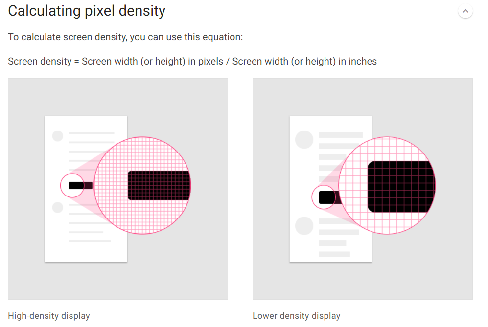
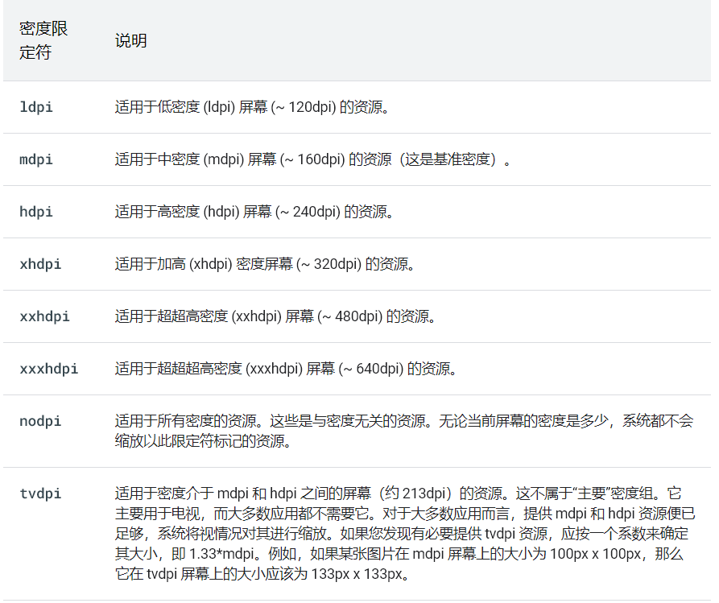

## 概念

>  `Android Developer`中提到的屏幕兼容性概念：`https://developer.android.com/guide/practices/screens_support?hl=zh-cn`

运行`Android`的设备多种多样，它们有着不同的屏幕尺寸和像素密度。 尽管系统可通过基本的缩放和调整大小功能使界面适应不同屏幕，但您应做出进一步优化，以确保界面能够在各类屏幕上美观地呈现。

开发过程中需要考虑屏幕兼容性，也就是`Android`屏幕适配。

一般来讲会从两个角度来处理屏幕兼容性问题：

- 支持不同的屏幕尺寸
- 支持不同的像素密度

1. 屏幕尺寸

   >系统为应用界面提供的可见空间。需要综合考虑屏幕方向、系统装饰（导航栏）和窗口配置更改（如用户启用了多窗口模式）后的尺寸。
   >
   >`Android`设备的形状和尺寸多样性， 因此应用的布局需要十分灵活，也就是说，布局应该能够应对不同屏幕尺寸和方向，而不是为布局定义刚性尺寸。支持尽可能多的屏幕，能够使得应用运行在各种不同的设备上，保证使用单个`APK`可以将其提供给更多的用户。

   - 灵活布局

     避免对界面组件的位置和大小的硬编码。允许拉伸视图尺寸并指定视图相对于父视图或其他同级视图的位置。

     

   - 备用布局

     根据不同设备（手机和平板电脑）上的可用空间优化用户体验。系统在运行时根据当前设备的屏幕尺寸应用不同的布局文件。

   - 可拉伸图像

     布局能够通过拉伸适应屏幕，附加在任何布局视图的位图也应该支持拉伸。为了避免朝任意方向拉伸普通位图可能导致的缩放失真以及图像倾斜问题，可以使用`Android`支持九宫位图。

2. 像素密度

   屏幕单位面积内的像素数，称为`dpi`(`Android developer`上的描述有所偏颇，实际的`Android dpi`计算方式是斜对角线上的每英寸的像素数)

   - 密度独立性

     保持密度独立性很重要，否则界面元素会在低密度屏幕上显示时可能会变大，在高密度屏幕上显示时则会变小。

     应用在不同像素密度的屏幕上的显示保留界面设计的物理尺寸（用户角度）说明实现了`密度独立性`。

     通过提供密度独立像素（`dp`或`dip`）而非像素（`px`）作为使用的测量单位。

   - 备用位图

     为了确保图像在所有屏幕上显示最佳效果，应该提供备用位图来适应各种屏幕密度。

   - 矢量图片

     对于简单类型的图像(通常为图标)，可以使用矢量图形，以避免为每个密度创建单独的图像。由于矢量图形使用几何线条路径（而非像素）来定义插图，因此，可以在不产生缩放失真问题的情况下绘制任意尺寸。

3. 屏幕类型

   - 刘海屏、水滴屏

在开始之前需要了解到`Android`中常见的一些度量单位。

### 单位

**`in`**

`含义`：`inches` ；用于描述屏幕的物理尺寸（对角线长度，`1 in = 2.54 cm` ）

**`pt`**

`含义`：`points`；物理尺寸相关的长度单位（`1 pt = 1/72 in`）

**`px`**

`含义`：描述屏幕上的实际像素。一般使用`横向像素数 * 纵向像素数`描述屏幕分辨率；

**`dpi`**

`含义`：`dots per inch` 每英寸点数。

在谷歌设计文档中提到`屏幕像素密度`的计算方式：



也会有人提到一种`ppi`的概念：每英寸像素数，计算方法其实可以由上述推导出来：
$$
ppi = \sqrt{ wp^2 + hp^2 } / size,\\
wp = 横向宽度上的像素数\\
hp = 纵向高度上的像素数\\
$$
这里的`ppi`值一般来讲不会等同于`dpi`值，`dpi`的定义暂时不得而知，能够在代码中获取到设备`dpi`值：

```java
float density = context.getResources().getDisplayMetrics().density;
```

对于`dpi`和`ppi`的概念不再考究。

获取。

**`dp/dip`**

`含义`：`density-independent pixels`，密度无关像素；基于屏幕像素密度`dpi`的一个抽象单位。取`160dpi`为基准，`1dp = 1px`；`dp`和`px`的转换只和`dpi`相关。在不同屏幕像素密度的转换方法：`dp = (width in pixels * 160) / screen density`

`意义`：设计图一般以`px`为单位，适配不同屏幕像素密度的表现

**`sp`**

`含义`：`scale-independent pixel or scaleable pixels` 独立比例像素，依赖于`屏幕像素密度`和`用户字体设定(大字号)`

`谷歌设计文档`：`https://material.io/design/layout/pixel-density.html#pixel-density`

[谷歌设计文档](https://material.io/design/layout/pixel-density.html#pixel-density)

## 支持不同的屏幕尺寸

要实现屏幕尺寸的兼容性一般可以通过布局技巧解决。

### 灵活布局

默认情况下，`Android`会调整应用布局的大小，为确保布局调整能很好地适应屏幕尺寸的微小变化，您需要灵活地实现布局。避免对界面组件的位置和大小进行硬编码。应允许拉伸视图尺寸并指定视图相对于父视图或其他同级视图的位置，这样即便布局扩大，期望的顺序和相对大小也会保持不变。

**使用`ConstraintLayout`**

最佳做法是使用`ConstraintLayout`作为界面基本布局。可以根据布局中视图之间的控件关系指定每个视图的位置和大小。但是`ConstraintLayout`不能解决所有的布局场景，尤其是动态加载的列表。

但是无论使用何种布局，都应该避免对布局尺寸进行硬编码。

**避免使用硬编码的布局尺寸**

为了确保布局能够灵活适应不同的屏幕尺寸，应该对大多数的视图组件的宽高使用

`wrap_content：`只是视图将其尺寸设置为适配该视图中相应内容所需的尺寸。

`match_parent：`使视图在父视图中尽可能地展开。

`LinearLayout`可以按布局权重展开子视图，但是在嵌套的`LinearLayout`中使用权重会要求系统执行多次布局遍历以确定每个视图的尺寸。会降低界面性能。

`ConstraintLayout`几乎能够构建`LinearLayout`所能构建的所有布局而不会影响性能，所以可以将`LinearLayout`布局转化成`ConstraintLayout`，然后使用约束链来定义加权布局。

> `注意：`在使用`ContraintLayout`时，不得使用`match_parent`。而应该将尺寸设置为`0dp`以启用一种称作`匹配约束`的特殊行为。该行为通常与`match_parent`的预期行相同。如果设置了`match_parent`虽然不会报错，但是，该方向上的约束会失效。

### 创建备用布局

设计不同的布局以便根据不同设备（手机、平板电脑）上可用空间优化用户体验。`Android`允许提供备用布局文件，而系统会在运行时根据当前设备的屏幕尺寸应用这些文件。

可以通过创建额外的`res/layout/`目录提供特定于屏幕的布局（针对需要不同布局的每种屏幕配置创建一个目录），然后将屏幕配置限定符附加到`layout`目录名称（例如，对于可用宽度为`600dp`的屏幕，附加限定符为`layout-w600dp`）

这些配置限定符表示应用界面可用的可见屏幕空间，从应用中选择布局时，系统会考虑所有系统装饰（例如导航栏）和窗口配置更改（例如，当用户启用多窗口模式时）


**使用最小宽度限定符**

使用`最小宽度`屏幕尺寸限定符，可以为具有最小宽度（以密度无关像素`dp`或`dip`为度量单位）的屏幕提供备用布局。最小宽度限定符指定屏幕两侧的最小尺寸，而不考虑设备当前的屏幕方向，因此是一种指定布局可用的整体屏幕尺寸的简单方法。

通过将屏幕尺寸描述为密度无关像素的度量值，`Android`允许创建转为非常具体的屏幕尺寸而设计的布局。例如，创建一个名为`main_activity`且针对手机和平板电脑进行优化的布局，方法是在目录中创建该文件的不同版本：

```te
res/layout/main_activity.xml           # For handsets (smaller than 600dp available width)
res/layout-sw600dp/main_activity.xml   # For 7” tablets (600dp wide and bigger)
```

下面是其他最小宽度值与典型屏幕尺寸的对应关系：

- `320dp`：典型手机屏幕（`240x320 ldpi`、`320x480 mdpi`、`480x800 hdpi`等）。
- `480dp`：约为 5 英寸的大手机屏幕 (`480x800 mdpi`)。
- `600dp`：7 英寸平板电脑 (`600x1024 mdpi`)。
- `720dp`：10 英寸平板电脑（`720x1280 mdpi`、`800x1280 mdpi`等）。


> 最小宽度限定符的所有数值都是密度无关像素，因为重要的时系统考虑像素密度（而不是原始像素分辨率）之后的屏幕空间值
>
> `注意：`这些限定符指定的尺寸不是实际屏幕尺寸，而是`Activity`窗口可用的宽度或高度（`dp`为单位）。`Android`系统可能会将部分屏幕用于系统界面（如屏幕底部的系统蓝或顶部的状态栏）因此部分屏幕可能不可供布局使用，如果应用在多窗口模式下使用，则只能使用该窗口的尺寸。对该窗口进行大小调整时，会使用新窗口尺寸触发配置更改，以便系统可以选择适当的布局文件。因此，在声明尺寸时，您应具体说明 Activity 需要的尺寸。在声明为布局提供的空间时，系统会考虑系统界面使用的所有空间。

**使用可用宽度限定符**

希望根据当前可用的宽度或高度更改布局，而不是根据屏幕的最小宽度来更改布局。

例如，希望屏幕宽度在至少`600dp`时使用该布局，但是屏幕宽度可能会根据设备的屏幕方向发生变化，在这种情况下应该使用`可用宽度`限定符。如下：

```tex
res/layout/main_activity.xml         # For handsets (smaller than 600dp available width)
res/layout-w600dp/main_activity.xml  # For 7” tablets or any screen with 600dp
                                     #   available width (possibly landscape handsets)  
```

> 如果关心可用高度，则可以使用`可用高度`限定符来执行相同的操作。如屏幕高度至少为`600dp`的屏幕，使用限定符`layout-h600dp`

**添加屏幕方向限定符**

虽然您可能只需将“最小宽度”和“可用宽度”限定符结合使用即可支持所有尺寸变化，但是您可能还希望当用户在纵向与横向之间切换屏幕方向时改变用户体验。

为此，可以将`port`或`land`限定符添加到资源目录名称中，保证这些限定符在其他尺寸限定符后面即可。

```tex
res/layout/main_activity.xml                # For handsets
res/layout-land/main_activity.xml           # For handsets in landscape
res/layout-sw600dp/main_activity.xml        # For 7” tablets
res/layout-sw600dp-land/main_activity.xml   # For 7” tablets in landscape
```

### 使用`Framgent`将界面组件模块化

针对多种屏幕尺寸设计应用（手机、平板），确保不会在`Activity`之间不必要地重复界面行为，因此应该使用`Fragment`将界面逻辑提取到单独的组件中。然后组合`Fragment`以便在大屏幕设备上运行时创建多窗格布局，或者在手机上运行时将`Fragment`放置在单独的`Activity`中。

`https://developer.android.com/guide/components/fragments`

`Android 3.0 API 11` 引入了`Fragment`，主要目的是为大屏幕（平板电脑）上更加动态和灵活的界面设计提供支持。使用片段实现此类设计，无需管理对试图层次结构做出的复杂更改。通过将`Activity`布局分成各个片段，在运行时修改`Activity`外观，并且在`Activity`管理的返回栈中保留这些更改。

### 创建可拉伸的九宫格位图

在改变尺寸的视图中将位图用作背景，会注意到，当视图根据屏幕尺寸或视图中的内容增大或缩小时，`Android`会缩放图片，导致明显的模糊或其他缩放失真。解决方案是使用九宫格位图，这种特殊格式的`png`文件会只是哪些区域可以拉伸，哪些区域不可以拉伸。

### 声明特定的屏幕尺寸支持

如果不想让应用以特定的屏幕尺寸运行，可以设置屏幕尺寸限制，甚至可以根据设备的屏幕配置限制哪些设备可以安装应用。

`https://developer.android.com/guide/practices/screens-distribution`

### 旧尺寸限定符支持`Android 3.1`

如果应用支持`Android 3.1 API 12`或者耕地版本，除了上面的最小/可用宽度限定符之外，还需要使用`旧尺寸限定符`。


## 支持不同的像素密度

`Android`设备不仅有不同的屏幕尺寸（手机、平板电脑、电视等），而且其屏幕也有不同的像素尺寸。如果不考虑像素密度的差异，系统就可能缩放图片或者以错误的尺寸显示。

### 使用密度无关像素

首要避免的就是使用像素来定义距离或尺寸。不同的屏幕具有不同的像素密度，同样数量的像素在不同的设备上可能对应于不同的物理尺寸。

要在密度不同的屏幕上保留界面的可见尺寸，必须是哦那个密度无关像素（`dp`）作为度量单位来设计界面。`dp`是虚拟像素单位，以`中密度屏幕`(`160dpi`)为基准的的屏幕上，`1dp = 1px`。

定义文本大小时应该改用可缩放像素`sp`作为单位。默认情况下`dp`和`sp`大小相同，但是`sp`会更具用户的首选文本大小来调整大小。

**`dp`转为像素单位**

某些情况下，需要以`dp`表示尺寸，然后将其转换成像素。`dp`单位转换成屏幕像素很简单：

`px = dp * (dpi / 160)`

假设在某一应用中，用户的手指至少移动`16`像素之后才能识别出滚动或滑动搜狐是。在基准屏幕中，用户必须移动`16 pixels / 160 dpi`（`1/10`英寸或`2.5`毫米），系统才会识别该手势，而在配置高密度显示屏(`240dpi`)的设备上，用户的手指必须至少移动`16 pixels / 240 dpi`（`1/15`英寸或`1.7`毫米）距离很多。

要解决此问题，需要在代码中以`dp`作为手势阈值，然后再转换成实际像素，例如：

```java
// The gesture threshold expressed in dp
private static final float GESTURE_THRESHOLD_DP = 16.0f;

// Get the screen's density scale
final float scale = getResources().getDisplayMetrics().density;
// Convert the dps to pixels, based on density scale
mGestureThreshold = (int) (GESTURE_THRESHOLD_DP * scale + 0.5f);

// Use mGestureThreshold as a distance in pixels...
```

> `DisplayMetrics.density` 字段根据当前像素密度指定将 `dp` 单位转换为像素时所必须使用的缩放系数。在中密度屏幕上，`DisplayMetrics.density` 等于 1.0；在高密度屏幕上，它等于 1.5；在超高密度屏幕上，等于 2.0；在低密度屏幕上，等于 0.75。此数字是一个系数，用其乘以 `dp` 单位，即可得出当前屏幕的实际像素数。

**使用预缩放的配置值**

可以使用`ViewConfiguration`获取`Android`常用的距离、速度和时间。如`getScaledTouchSlop()`获取框架用作滚动阈值的距离（`piexls`）

```java
private static final int GESTURE_THRESHOLD_DP 
    = ViewConfiguration.get(myContext).getScaledTouchSlop();
```

> `ViewConfiguration`中以`getScale`前缀开头的方法确定会返回不管当前屏幕密度为何都会正常显示的像素值。

### 提供备用位图

要在像素密不同的设备上提供良好的图像质量，应该以响应的分辨率再应用中提供每个位图的多个版本。否则`Android`系统必须缩放位图，使其再每个屏幕上占据相同的可见空间，从而导致缩放失真。

适用于不同像素密度的配置限定符：



要针对不同的密度创建备用可绘制位图资源，应该遵循六种主要密度之间的`3:4:6:8:12:16`缩放比。例如，有一个可会知位图资源，再中密度屏幕上的大小为`48px * 48px`像素，那么再其他各种密度的屏幕上大小应该为：

- `36x36 `(`0.75x`) - 低密度 (`ldpi`)
- `48x48`（`1.0x `基准）- 中密度 (`mdpi`)
- `72x72 `(`1.5x`) - 高密度 (`hdpi`)
- `96x96 `(`2.0x`) - 超高密度 (`xhdpi`)
- `144x144 `(`3.0x`) - 超超高密度 (`xxhdpi`)
- `192x192 `(`4.0x`) - 超超超高密度 (`xxxhdpi`)

当引用位图资源时，系统根据屏幕`dpi`选择相应的位图，如果没有为某个密度提供特定于密度的资源，那么系统会选取下一个最佳匹配项并对其进行缩放以适合屏幕。

> 配置限定符以及`Android`如何根据当前屏幕配置选择恰当的资源： [查看](https://developer.android.com/guide/topics/resources/providing-resources?hl=zh-cn)

**将应用图标放在`mipmap`目录中**

与其他所有位图资源一样，对于应用图标，也需要提供特定于密度的版本。不过某些应用器显示的应用图标会比设备的密度级别所要求的大`25%`。因此应该将所有应用图标都放在`mipmap`目录中，而不是放在`drawable`目录中。与`drawable`目录不同，所有`mipmap`目录都会保留在`APK`中，及时构建特定于密度的`APK`也是如此。

### 改用矢量图形

除了创建多个特定于密度的图片版本之外，另一种方法是仅创建一个矢量图形。在借助矢量图形创建图片时，使用`XML`定义路径和颜色，而不是使用像素位图。因此，矢量图形可以缩放到任何尺寸而不会出现缩放失真。不过通常适合图标等插图，不太适合图片。

失恋图片通常以`SVG`（可缩放矢量图形）文件的形式提供，但是`Android`不支持该格式因此必须将`SVG`文件转换成`Android`的矢量图格式。

### 针对不常见密度问题给出的建议

`Android`系统如何在像素密度不同的屏幕上对位图执行缩放，以及如何进一步控制位图在像素密度不同的屏幕上的绘制方式。

1. 预缩放资源

   根据当前屏幕的密度，系统使用应用中特定于密度的任何资源。如果没有针对相应密度的资源可用，会加载默认资源，并根据需要将其放大或者缩小。系统假定默认资源（即没有配置限定符的目录中的资源）是针对基准像素密度(`mdpi`)设计的，并且会调整这些位图的大小，使其大小适合当前像素密度。

   某些情况下，可能不希望Android系统与缩放资源。要避免预缩放，最简单的方法就是将资源放在带有`nodpi`配置限定符的资源目录中。

2. 自动缩放像素尺寸和坐标

   可以停用预缩放：将清单中的`android:anyDensity`设置为`false`；或者针对`Bitmap`以编程方式将`inScaled`设置为`false`。这种情况下，系统会在绘图时自动缩放所有绝对像素坐标和像素尺寸值。这样做是为了确保按像素定义的屏幕元素的显示尺寸与其在基准像密度（`mdpi`）屏幕上的物理尺寸大致相同。系统将以对应用透明的方式处理此缩放。并向应用报告缩放后的像素尺寸，而不是物理像素尺寸。

   通常不应该停用预缩放，最好的方法就是遵循基本技巧。

如果应用操控位图或以其他某种方式直接与屏幕上的像素交互，可能需要采取其他措施来支持不同的像素密度。例如通过计算手指划过的像素数来相应触摸手势，那么需要使用适当的密度无关像素值，而不是实际像素值，但是可以轻松的在`dp`和`px`值之间转换。

## 支持刘海屏

在搭载`Android 9 API 28`及更高版本的设备上正式支持刘海屏（设备制造商可以选在在搭载`Android 8/1`或更低版本的设备上支持刘海屏）

### 设备要求：

为了确保一致性和应用兼容性，搭载`Android 9`的设备必须确保以下刘海行为：

- 一条边缘最多只能包含一个刘海
- 一台设备不能有两个以上的刘海
- 设备的两条较长边缘不能有刘海
- 未设置特殊标志的竖屏模式下，状态栏的高度必须和刘海的高度持平
- 默认情况下，在全屏模式或横屏模式下，整个刘海区域必须显示黑边

### 处理刘海区域

不希望内容和刘海区域重叠， 确保内容不与状态栏和导航栏重叠即可。

如果要将内容呈现到刘海区域中，可以使用`WindowInsets.getDisplayCutout()`来检索`DisplayCutout`对象。包含每个刘海区域的安全边衬区和边界框。可以使用这些`API`检查内容是否和刘海区域重叠，以便根据需要重新放置。

> 需要在多个`API`级别管理刘海实现，可以使用`AndroidX`库（通过`SDK`管理器获得）中的`DispayCutoutCompat`

`Android`还允许控制是否在刘海区域内显示内容。窗口布局属性`layoutInDisplayCutoutMode`控制内容如何呈现在刘海区域中。可以将`LayoutInDisplayCutoutMode`设置为以下某个值：

- [LAYOUT_IN_DISPLAY_CUTOUT_MODE_DEFAULT](https://developer.android.com/reference/android/view/WindowManager.LayoutParams?hl=zh-cn#LAYOUT_IN_DISPLAY_CUTOUT_MODE_DEFAULT) - 这是默认行为，如上所述。在竖屏模式下，内容会呈现到刘海区域中；但在横屏模式下，内容会显示黑边。
- [LAYOUT_IN_DISPLAY_CUTOUT_MODE_SHORT_EDGES](https://developer.android.com/reference/android/view/WindowManager.LayoutParams?hl=zh-cn#LAYOUT_IN_DISPLAY_CUTOUT_MODE_SHORT_EDGES) - 在竖屏模式和横屏模式下，内容都会呈现到刘海区域中。
- [LAYOUT_IN_DISPLAY_CUTOUT_MODE_NEVER](https://developer.android.com/reference/android/view/WindowManager.LayoutParams?hl=zh-cn#LAYOUT_IN_DISPLAY_CUTOUT_MODE_NEVER) - 内容从不呈现到刘海区域中。

可以通过编程或者在`Acitivity`中设置样式来设置刘海模式。

**内容呈现在短边刘海区域**

对于某些内容（视频、照片、地图和游戏），呈现在刘海区域是一种很好的方法，这样能够为用户提供沉浸感更强的全面屏体验。

如果设置了`LAYOUT_IN_DISPLAY_CUTOUT_MODE_SHORT_EDGES`，在书评模式和横屏模式下，内容都会延伸显示屏的短边的刘海区域，而不管系统栏处于隐藏还是可见状态。窗口无法延伸到屏幕的长边上的刘海区域。确保没有重要内同和刘海区域重叠。(边角处的刘海可等同于在短边上，因此适用于同样的行为)

`Android`可能不允许内容视图与系统栏重叠，要替换此行为并强制内容延伸到刘海区域，可以通过`View.setSystemUiVisibility(int)`方法将标志：

- `SYSTEM_UI_FLAG_LAYOUT_FULLSCREEN`
- `SYSTEM_UI_FLAG_LAYOUT_HIDE_NAVIGATION`
- `SYSTEM_UI_FLAG_LAYOUT_STABLE` 

**从不将内容呈现在刘海区域**

设置了 `LAYOUT_IN_DISPLAY_CUTOUT_MODE_NEVER`，则不允许窗口和刘海区域重叠。

此模式应该用于暂时设置`View.SYSTEM_UI_FLAG_FULLSCREEN`或`View.SYSTEM_UI_FLAG_HIDE_NAVIGATION`的窗口，以避免在设置或清除了该标志时执行另一种窗口布局。

**特殊模式**

某些搭载`Android 8.1 API 27`或更低版本的设备支持一种特殊模式，可让用户将显示黑边的全屏或横屏应用延伸到刘海区域。此模式通常使用导航栏中的切换开关来控制，在延伸屏幕之前会显示一个对话框，要求用户进行确认。


### 支持刘海屏的最佳做法

- 不要让刘海区域遮盖任何重要的文本、控件或其他信息
- 不要将任何需要精细轻触识别的交互式元素放置或延伸到刘海区域。刘海区域中的轻触灵敏度可能要比其他区域低一些。
- 避免对状态栏高度进行硬编码，因为可能会导致内容重叠或者被切断。如果有可能，使用`WindowInsetsCompat`检索状态栏高度，并确定要对内容应用的适当内边距。
- 不要假定应用会占据整个窗口，而应该使用`View.getLocationInWindow()`确认应用位置，不要使用`View.getLocationOnScreen()`
- 妥善处理进入或退出全屏模式
- 对于竖屏模式下的默认刘海行为，如果刘海区域位于顶部边缘，并且窗口未设置 `FLAG_FULLSCREEN `或 `View.SYSTEM_UI_FLAG_FULLSCREEN`，则窗口可以延伸到刘海区域。同样，如果刘海区域位于底部边缘，并且窗口未设置 `View.SYSTEM_UI_FLAG_HIDE_NAVIGATION`，则窗口可以延伸到刘海区域。在全屏模式或横屏模式下，窗口的布局方式应确保其不与刘海区域重叠。
- 如果您的应用需要进入和退出全屏模式，请使用 `shortEdges` 或 `never` 刘海模式。默认刘海行为可导致应用中的内容在全屏模式转换过程中上下移动，如下图所示：
- 在全屏模式下，在使用窗口坐标与屏幕坐标时应保持谨慎，因为在显示黑边的情况下，您的应用不会占据整个屏幕。由于显示黑边，因此根据屏幕原点得到的坐标与根据窗口原点得到的坐标不再相同。您可以根据需要使用 [getLocationOnScreen()](https://developer.android.com/reference/android/view/View?hl=zh-cn#getLocationOnScreen(int[])) 将屏幕坐标转换为视图坐标。下图展示了内容显示黑边时这两种坐标有何不同：


处理 `MotionEvent` 时，请使用 `MotionEvent.getX()` 和 `MotionEvent.getY()` 来避免类似的坐标问题。不要使用 `MotionEvent.getRawX()`或`MotionEvent.getRawY()`

### 测试内容呈现

`Android 9`的任意设备和模拟器上可以模拟一些常见的刘海配置，具体操作步骤：

- 启用开发者选项
- 绘制部分 - 模拟刘海屏
- 选择刘海类型


## 适配方案

### 为什么？

`Android`系统开源免费，任何用户、开发者、`OEM`厂商、运营商都可以对`Android`进行定制，导致`屏幕碎片化`，表现就是屏幕尺寸、分辨率不同。

一般来说设计稿标注的是`px`值，因为屏幕的分辨率和屏幕尺寸的差异，使用`px`值会在不同屏幕像素密度的设备上有明显的视觉差异。所以屏幕适配的首要内容就是：保证在不同尺寸、不同分辨率上的设备上能够有相对一致的视觉表现。

### 布局适配方案

**像素密度适配**

- 采用密度无关像素单位：`dp`。
  - 需要注意的是不同的`dpi`的设备屏幕，宽度的`dp`值不一定是固定的某个值(`360dp`)。所以设计图上给出的值未必可以直接拿来用。

**屏幕尺寸适配**

- 灵活布局

  - 建议使用`ConstranitLayout`布局，通过约束组件间的相对位置，能够调整布局，同样也支持百分比，也能在一定程度上降低布局嵌套问题。
  - 避免硬编码。尽量使用`wrap_content`或`match_parent`。尤其是当组件有明显的布局特征，如组件宽度需要平分布局宽度，或呈现的百分比时，需要一定的布局技巧。

- 备用布局

  > 一般是根据不同设备上（手机、平板电脑）上的可用空间来优化用户体验。创建额外的`layout`目录，使用屏幕配置限定符，附加到`layout`目录名称。

  - 最小宽度限定符
  - 可用宽度限定符
  - 屏幕方向限定符

- `Framgent`将界面组件模块化

  > `Android 3.0 API 11` 时候引入了`Fragment`，将模块化和可重用性引入了`Activity`界面，更适合定义和管理单个屏幕或部分屏幕的界面。 
  >
  > [Fragment概览](https://developer.android.google.cn/guide/fragments)

### 图片适配方案

 **屏幕尺寸适配**

- 创建可拉伸的九宫格位图

**像素密度适配**

- 提供备用位图
  - 针对不同的像素密度，提供多个版本的位图
  - 放置在`mipmap`目录下
- 改用矢量图形

